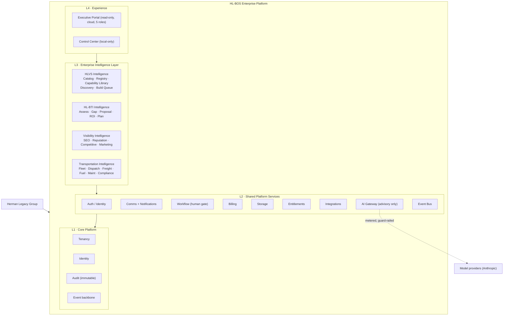
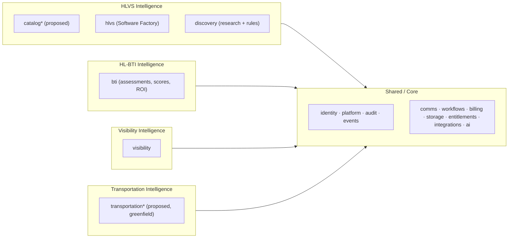
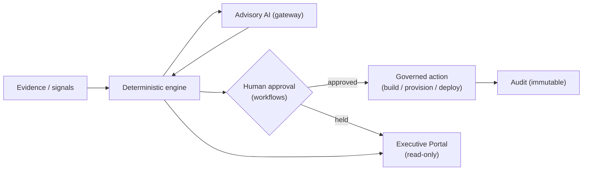

# 2 · Updated Platform Diagram

## Full platform (layered)

## Data-plane mapping (schemas → subsystems)

`* proposed` = designed in this blueprint, not implemented. Everything else exists today (17 live schemas, 27 migrations, 100% RLS).

## Engine-plane mapping (packages → subsystems)

| Package (today)                        | Serves              | Role                                                                   |
| -------------------------------------- | ------------------- | ---------------------------------------------------------------------- |
| `@hl-bos/catalog`                      | HLVS                | Enterprise Catalog + Application Registry + Software Factory assembler |
| `@hl-bos/transformation-intelligence`  | HL-BTI + Government | Pipeline, impact/ROI, factory reuse, approval gating                   |
| `@hl-bos/bti-engine`                   | HL-BTI + Visibility | Scoring, consulting findings, growth/SEO dimensions                    |
| `@hl-bos/config`                       | all                 | The only sanctioned env reader                                         |
| _(proposed)_ `@hl-bos/discovery-intel` | HLVS                | External-research collectors + opportunity scoring                     |
| _(proposed)_ `@hl-bos/transport-intel` | Transportation      | Fleet/dispatch/fuel deterministic engines                              |

## The single control loop

Every subsystem plugs into this one loop. There is no second control plane, no second UI, and no second approval mechanism — which is precisely how "one platform, no duplication" is enforced structurally rather than by policy.
