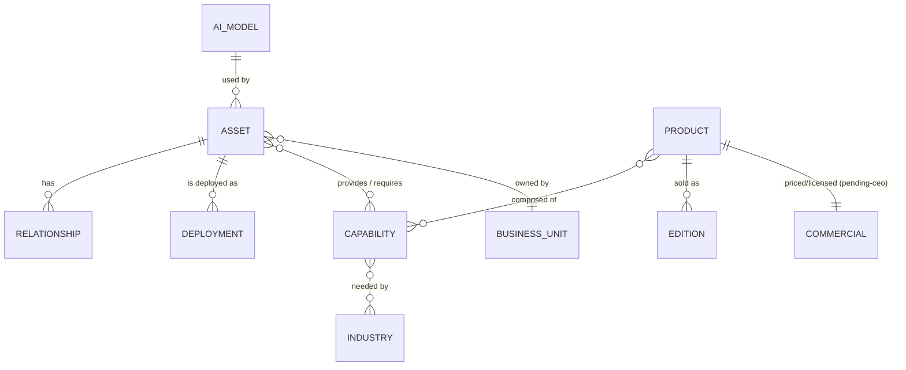

# 3 · Enterprise Catalog Design

## Position

The Enterprise Catalog is the **single source of truth for the software estate**. It is the spine of HLVS Intelligence and the reference every other subsystem resolves against. It already exists as `@hl-bos/catalog` (curated registry + scanner + completeness + Software Factory); this design elevates it to the authoritative, persisted, enterprise-wide catalog the directive calls for.

## What the catalog is the source of truth for

The directive names 14 domains. Each maps to a catalog **entity type**:

| Domain         | Catalog entity                                                    | Exists today?                    |
| -------------- | ----------------------------------------------------------------- | -------------------------------- |
| Products       | `product` asset                                                   | ✅ registry.ts                   |
| Applications   | `application` asset + **Application Registry** operational record | ✅ Phase IX                      |
| Modules        | `module` asset (+ Capability Library link)                        | ✅                               |
| Services       | `shared_service` asset                                            | ✅                               |
| AI Models      | `ai_model` (from `ai` schema registry)                            | ⚠ in `ai` schema, not catalogued |
| Business Units | `business_unit`                                                   | ✳ new entity                     |
| Industries     | `industry_solution` asset                                         | ✅                               |
| Pricing        | `pricing_ref` on product commercial metadata                      | ⚠ pending-CEO by design          |
| Dependencies   | asset `relationships` (graph)                                     | ✅                               |
| Integrations   | `integration` asset (from `integrations` schema)                  | ⚠ partial                        |
| Deployments    | **Application Registry** deployment fields                        | ✅ Phase IX                      |
| Ownership      | asset `owner` + `executiveOwner`                                  | ✅                               |
| Licensing      | `licensing` commercial metadata                                   | ⚠ pending-CEO                    |
| Roadmaps       | `roadmap` links (from `discovery.roadmap_phases`)                 | ⚠ partial                        |

## Design principles (kept from the existing catalog)

1. **Register-before-build.** An asset on disk but not in the catalog is a _governance gap_, surfaced by `completeness`, never silent coverage. This stays the law.
2. **Counted, never asserted.** Completeness/readiness are measured against the filesystem/DB, not claimed.
3. **Honest commercial metadata.** Pricing/licensing/ownership carry an explicit `pending-ceo` status until the CEO sets them — the catalog never invents a price.
4. **Relationships are first-class.** The dependency graph (`provides`/`uses`/`owned_by`/`replaced_by`) powers reuse, impact analysis and search.

## Target model (entity types)

- **ASSET** — the existing 13 kinds (product, application, module, shared_service, ai_capability, business_capability, industry_solution, api, edge_function, database, workflow, repository, package).
- **DEPLOYMENT** — the Application Registry record (environment, URLs, branch, health, Supabase project). Today an operational overlay keyed by asset; §8 recommends it stays a projection, not a duplicate.
- **CAPABILITY** — see §5 (the unification of the three module registries).
- **BUSINESS_UNIT / AI_MODEL** — new lightweight entities (business units: HSCS, Herman Legacy Digital, 5 Star, Venuewise; AI models: from the `ai` schema provider/model registry).
- **COMMERCIAL / EDITION** — already modelled in `compositions.ts` (pending-ceo).

## Persistence recommendation (design only)

Today the catalog and Application Registry are **in-code** (version-controlled TypeScript, verified in CI). This is correct for a source-of-truth that must be reviewable and diffable. The recommendation:

- **Keep the in-code registry as the authoring surface** (reviewable, CI-verified, the governance record).
- **Add a proposed `catalog` schema** (§9) as a _read model_: a nightly/CI job projects the in-code catalog into DB tables so other subsystems and RPCs can query it at runtime without bundling the package. The in-code registry remains authoritative; the DB is a materialized projection. **No migration is written here — this is the design.**

## Single-source-of-truth guarantees

- Exactly one catalog module (`@hl-bos/catalog`) — every subsystem imports it; none maintains its own asset list.
- The Application Registry, Capability Library and Software Factory all read from the same asset graph.
- Completeness reconciliation runs in CI: filesystem ↔ catalog ↔ (future) DB projection must agree, or the build flags the drift.
