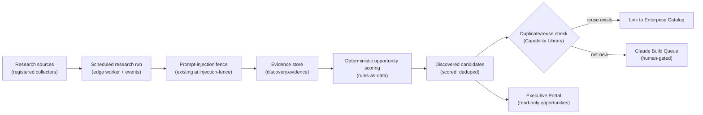
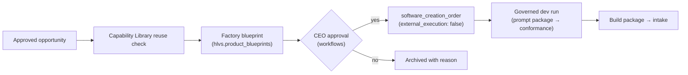

# 4 · Discovery Engine Architecture

## The absorbed HLVS vision

The original HLVS Venture Studio existed to **find, evaluate, and assemble** software opportunities. That is the Discovery Engine's mandate — rebuilt as a subsystem on the **existing `discovery` schema** (collectors → evidence → rules-as-data → recommendations), extended from _inward_ business discovery to _outward_ market/technology discovery.

**Architecture only. Nothing here is implemented.**

## What it continuously researches (the directive's list)

| Research stream           | Source class                                    | Reuses                                                                 |
| ------------------------- | ----------------------------------------------- | ---------------------------------------------------------------------- |
| Software Companies        | market/SaaS directories, Crunchbase-style feeds | `discovery.collectors` pattern                                         |
| Micro-SaaS                | indie/marketplace listings                      | collector + evidence                                                   |
| GitHub Projects           | GitHub search/trending API                      | GitHub MCP pattern (Phase IX proved reachable)                         |
| Acquisition Targets       | brokerage/marketplace listings                  | collector                                                              |
| Government Opportunities  | SAM.gov / solicitation feeds                    | **existing government module** (`@hl-bos/transformation-intelligence`) |
| AI Products               | model/product launch feeds                      | collector                                                              |
| White-Label Opportunities | reseller/OEM listings                           | collector                                                              |
| Emerging Technologies     | research/news/trend feeds                       | collector                                                              |
| New Business Models       | curated signals                                 | collector                                                              |

## The pipeline (one deterministic flow)

Design invariants (all inherited from the existing engine):

- **Advisory AI, deterministic scoring.** Opportunity scores come from `recommendation_rules`-style rows (weights, thresholds, confidence), never from a model's opinion. AI only summarizes and drafts.
- **Injection fence mandatory.** Untrusted web/GitHub content passes the existing `ai.injection-fence` before any model sees it — a hostile listing cannot hijack the pipeline.
- **Evidence-traced.** Every candidate cites the evidence and rule that surfaced it (the existing `rule_key`/`rule_version` provenance).
- **Deduped against what we own.** The Capability Library duplicate-check runs before anything reaches the build queue — we never propose building what already exists.

## Opportunity scoring model (rules-as-data)

An opportunity's score is a deterministic function of configurable dimensions, e.g.: strategic fit, capability reuse %, build effort (from the Software Factory), market signal strength, acquisition cost band, and risk. Each is a **row** (weight + threshold + confidence), so tuning is data, not code — identical to how `discovery.recommendation_rules` and the BTI scoring config already work. No hardcoded verticals.

## The Claude Build Queue

The governed bridge from _approved opportunity_ → _assembled software_, sitting **on top of the existing `hlvs` Software Factory** (creation orders → prompt packages → dev runs → conformance → build packages). It adds no new build machinery; it adds a **queue with a human gate**:

- **`external_execution: false` stays the default.** No autonomous build runs without an explicit, separate CEO decision — the existing factory guarantee.
- **Conformance is non-waivable.** Delivered work passes the deterministic conformance engine or it does not ship.
- Nothing in the queue _acts_; it _proposes_. Every state transition is a human-approved workflow.

## Boundary

The Discovery Engine belongs entirely to **HLVS Intelligence**. It reuses: `discovery` schema, `ai` gateway + injection fence, `events` bus + scheduler, `workflows` gate, the Capability Library, and the Software Factory. It introduces **one proposed engine package** (`@hl-bos/discovery-intel`) and **proposed `discovery` schema extensions** (§9) — no new services, no new UI (it surfaces in the portal).
