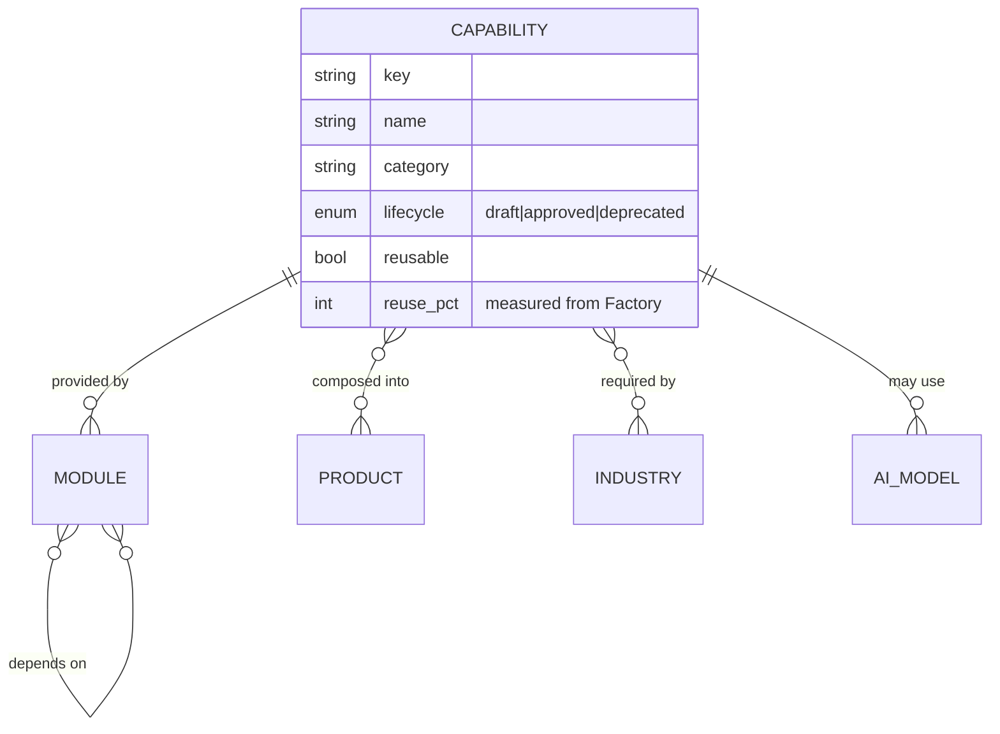

# 5 · Capability Library Design

## The problem it solves

Reuse is the platform's core value, but "a capability" is currently described in **three overlapping registries**:

| Registry                                                 | Where              | Purpose                                        |
| -------------------------------------------------------- | ------------------ | ---------------------------------------------- |
| `MODULE_REGISTRY` (19)                                   | `@hl-bos/catalog`  | Engineering modules the Factory assembles from |
| `hlvs.modules` / `hlvs.capabilities` (10)                | `hlvs` schema      | Factory's product-intelligence catalog         |
| `discovery.module_catalog` (23) / `service_catalog` (25) | `discovery` schema | Commercially-provisionable modules/services    |

They already cross-reference (`hlvs.modules.discovery_module_key` links two of them), but there is **no single canonical capability**. The Capability Library makes one.

## The canonical model

A **Capability** is the atomic unit of reuse — "the platform can do X." Everything else references it.



- **Capability** — the canonical concept (e.g. `scheduling`, `ai_receptionist`, `route_assessment`). Sourced by unifying `hlvs.capabilities` + the distinct capabilities implied by the module registries.
- **Module** — a concrete implementation that _provides_ one or more capabilities (the merged `MODULE_REGISTRY` ⋈ `hlvs.modules` ⋈ `discovery.module_catalog`).
- **Product / Industry / AI Model** — reference capabilities they compose/require/use.

## Unification rule (one key space)

Each capability gets **one key**; the three legacy registries become **projections** onto it:

- engineering view → modules that provide it (build/assemble),
- commercial view → the provisionable service/module (`discovery.*_catalog`),
- product view → which products compose it (`hlvs.products` / catalog compositions).

No registry is deleted; each is re-expressed as a _lens_ over the Capability Library, exactly as the Application Registry is a lens over the catalog. This is the anti-duplication backbone: **one place answers "do we already have X?"**

## The reuse/duplicate-check contract

The existing `hlvs.duplicate_check` (deterministic reuse/extend/adapter/new verdict, AI-advisory + human-approved) becomes a **Capability Library function**:

```
duplicateCheck(proposedCapability) -> {
  verdict: "reuse" | "extend" | "adapter" | "new",
  matchedCapabilities: [...],
  reusePct: number,            // from the Software Factory assembler
  humanApprovalRequired: true  // AI advice is never authoritative
}
```

Every Discovery Engine candidate and every Factory build order passes through it first. This is what operationalizes "reuse before rebuild" as _code_, not aspiration.

## Measured reuse

`reuse_pct` per capability/product is **counted** by the existing Factory assembler (`foundationReadinessPct`, shared-spine count) — never asserted. The Capability Library surfaces it so the CEO can see, per opportunity, "we can build this reusing N% of what we already own."

## Boundary

The Capability Library lives in **HLVS Intelligence**, inside `@hl-bos/catalog` (extending, not replacing, the module registry). It is consumed by Discovery, the Build Queue, Product Intelligence, and HL-BTI's "reusable HL product" recommendations (which already call the Factory reuse adapter).
