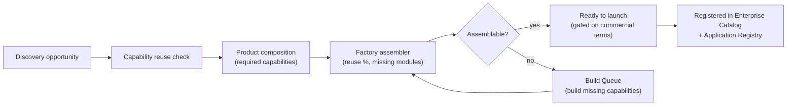

# 6 · Product Intelligence Architecture

## Definition

Product Intelligence answers: **"Given what we own, what products can we ship, how ready are they, and what would each new one cost to build?"** It is the decision layer over the Capability Library and the Software Factory — and it already largely exists (`compositions.ts`, `factory.ts`, `executiveReadiness()` in `@hl-bos/catalog`).

## The three questions and their engines

| Question                   | Engine (today)         | Output                                                            |
| -------------------------- | ---------------------- | ----------------------------------------------------------------- |
| What is a product made of? | `PRODUCT_COMPOSITIONS` | required modules, shared spine, edition, AI services              |
| Can we assemble it now?    | `assembleProduct()`    | built vs missing modules, `foundationReadinessPct`, `assemblable` |
| Is the portfolio ready?    | `executiveReadiness()` | platform/factory/commercial % (commercial gated on pricing)       |

## Product lifecycle (Discovery → Factory → Catalog)

## What Product Intelligence adds to the blueprint

1. **Commercial readiness stays honest.** Availability is computed from real assembly + terms; pricing/licensing/ownership remain `pending-ceo`. Product Intelligence never flatters a launch date or a price.
2. **Every product traces to capabilities.** A product is a _composition of capabilities_ (§5), so "reuse %" and "build effort" are derived, not guessed — the same numbers HL-BTI already shows for its "reusable HL product" recommendations.
3. **One assembler for all verticals.** SalonAI, TransportationAI, VisibilityAI, ReceptionAI etc. are compositions over the same spine; the assembler is shared. Transportation Intelligence products (fleet, dispatch) become new compositions, not new machinery.
4. **The Factory is the only build path.** Product Intelligence proposes; the governed Factory (creation order → conformance → build package) executes, human-gated.

## Relationship to the four subsystems

Product Intelligence is a **capability of HLVS Intelligence** that _serves the verticals_: HL-BTI recommends a product → Product Intelligence says what it takes to build/assemble it → the Factory builds it → the Catalog registers it → the Executive Portal shows the CEO the reuse %, effort, and required approvals. It is the connective tissue that makes the platform a _factory of vertical AI products_, which was the original HLVS ambition.
