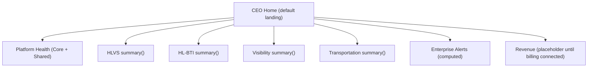

# 7 · Executive Dashboard Integration

## Principle

The **Executive Portal is the one UI**. Every intelligence subsystem integrates through the same three contracts — it never ships its own app or its own dashboard. Phase IX already built the shape (CEO Home, Task Center, Global Search, grouped nav); this section makes the integration a formal contract every subsystem implements.

## The subsystem integration contract

Each subsystem exposes exactly three read-only capabilities to the portal:

```ts
interface IntelligenceSubsystem {
  key: string; // "hlvs" | "hl_bti" | "visibility" | "transportation"
  summary(): SubsystemSummary; // → a CEO Home tile
  approvalQueue(): TaskItem[]; // → the Task Center
  searchIndex(): SearchDoc[]; // → Global Search
}
```

- **`summary()`** feeds one panel on **CEO Home** — headline metrics + health, provenance-labelled (live / sample / not-connected), never fabricated.
- **`approvalQueue()`** feeds the **Task Center** — the subsystem's items awaiting a CEO decision, each with the required approval type and gate.
- **`searchIndex()`** feeds **Global Search** — role-filtered, so sensitive results only reach authorized roles.

This is the generalization of what Phase IX already does ad-hoc for catalog, transformation intelligence and government. Formalizing it means adding a subsystem is _implementing one interface_, not editing the dashboard.

## CEO Home composition



Each subsystem tile links to its section; the dashboard is a **composition of `summary()` results**, not bespoke code per subsystem.

## Navigation (extends Phase IX groups)

Phase IX groups map cleanly onto the intelligence layer; the target adds the vertical groups:

```
Command          │ CEO Home · Task Center · Global Search
HLVS Intelligence│ Enterprise Catalog · Application Registry · Capability Library ·
                 │ Software Factory · Discovery · Build Queue
Business (HL-BTI)│ Assessments · Transformation · Gap · Proposal · ROI · Implementation
Visibility       │ SEO · Digital Visibility · Competitive · Reputation · Marketing
Transportation   │ Fleet · Dispatch · Freight · Fuel · Maintenance · Compliance
Governance       │ Commercial · CEO Decisions · Deployment · Approvals audit
Platform         │ Platform Status · Platform Health · Relationships
```

Governed by the existing pure `authz` matrix (role × view) — new views are rows, and every group is filtered by `canView`, so navigation cannot leak a view a role may not see (already tested).

## Non-negotiables carried forward

- **Read-only.** The portal renders decisions; it never executes them. Approvals route to `workflows`.
- **Server-side authorization** on every view; sensitive panels gated per role.
- **No command surface.** No `child_process`/git/pnpm/DB-writes — the portal stays safe to deploy publicly; the Control Center stays local-only.
- **Provenance on every number.** live / sample / not-connected, never a fabricated figure.
