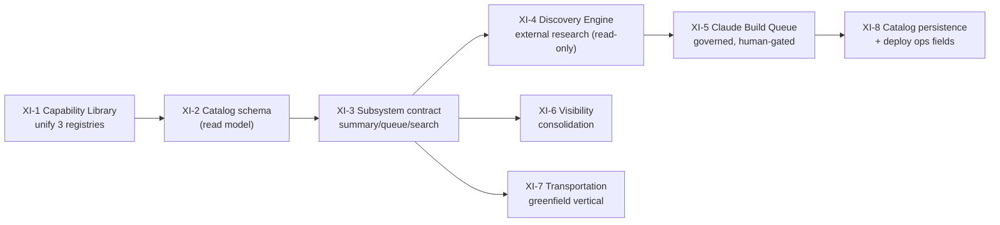

# 12 · Phase XI Implementation Roadmap

Sequenced so each stage is **independently valuable, reuse-maximizing, and approval-gated**. Every stage obeys the standing stop conditions: no production deploy, no migration applied without explicit CEO approval, no DNS/auth/business-logic/customer-data change without approval, never push to `main` directly.

## Sequencing principle

Build the **connective tissue first** (catalog persistence + capability unification), because every other subsystem resolves against it. Then formalize the **integration contract**, then extend outward (Discovery), then add the **greenfield vertical** (Transportation) last, since it reuses everything the earlier stages harden.

## Stages

| Stage    | Deliverable                                                                                                                                                            | Reuses                                                     | Approval gate                            | Risk     |
| -------- | ---------------------------------------------------------------------------------------------------------------------------------------------------------------------- | ---------------------------------------------------------- | ---------------------------------------- | -------- |
| **XI-1** | **Capability Library** — one canonical capability model; the 3 registries become lenses; `duplicateCheck()` as a library function                                      | `@hl-bos/catalog`, `hlvs.duplicate_check`                  | code review only (in-code, no migration) | low      |
| **XI-2** | **`catalog` read-model schema** — project in-code catalog/registry/capabilities to DB                                                                                  | house DB pattern                                           | **migration approval**                   | med      |
| **XI-3** | **`IntelligenceSubsystem` contract** — refactor Phase IX adapters to `summary/approvalQueue/searchIndex`; dashboard composes them                                      | Portal, Phase IX code                                      | code review only                         | low      |
| **XI-4** | **Discovery Engine (read-only research)** — registered sources, scheduled runs, scored candidates, injection-fenced; surfaced as opportunities                         | `discovery` schema, `ai` gateway+fence, `events` scheduler | **migration + connect research sources** | med      |
| **XI-5** | **Claude Build Queue** — approved opportunity → factory order, `external_execution:false`, conformance-gated                                                           | `hlvs` factory, `workflows`                                | **CEO approval per build**               | med      |
| **XI-6** | **Visibility consolidation** — fold `visibility` prototype + growth dimensions into a first-class subsystem with `visibility_*` RPCs                                   | `visibility` schema, bti-engine growth                     | **migration approval**                   | med      |
| **XI-7** | **Transportation Intelligence (greenfield)** — `transportation` schema + dimension pack over the BTI scoring engine; `transport_*` RPCs; convergence path for HSCS-GLP | BTI scoring engine, shared spine                           | **migration approval**                   | med-high |
| **XI-8** | **Catalog persistence + deployment ops** — DNS/TLS/last-deploy/health fields (nullable, evidence-gated); live health when hosting connected                            | Application Registry                                       | **connect hosting/DNS**                  | med      |

## What must stay true at every stage

1. **Deterministic authority, advisory AI, human approval** — no stage lets AI score, approve, or execute.
2. **Nothing fabricated** — new fields are nullable + evidence-gated; unknown stays unknown.
3. **One platform** — every stage adds a _subsystem/lens/adapter_, never a standalone app or a duplicate service.
4. **Reuse measured, not claimed** — the Factory assembler supplies reuse %; the Capability Library arbitrates duplication before any build.
5. **Gates before edges** — migrations, deploys, DNS, and builds are individual CEO approvals, surfaced in the Task Center.

## First recommended step (lowest risk, highest leverage)

**XI-1 (Capability Library unification)** — it is in-code (no migration), it hardens the anti-duplication backbone every later stage depends on, and it immediately improves the reuse numbers HL-BTI and Product Intelligence already show the CEO. It can be built, tested, and reviewed on a feature branch with zero production impact.

## Success criteria for Phase XI

When XI-1 → XI-3 land, HL-BOS has **one catalog, one capability library, and one dashboard contract** — the structural end of architectural ambiguity. XI-4 → XI-8 then extend the platform outward (research, verticals) without ever creating a second architecture. That is the unified AI Business Transformation Platform the directive set out to establish.
