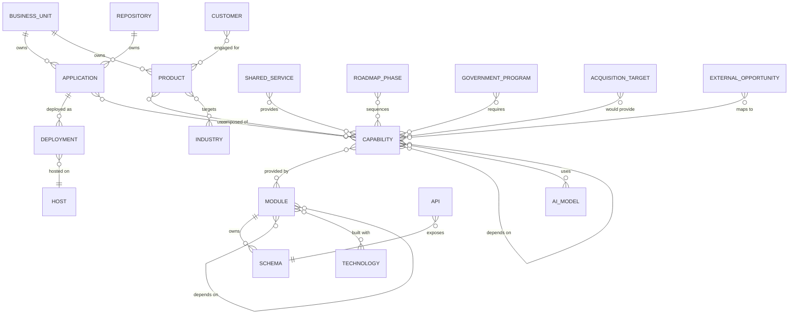

# 2 · Complete Entity Relationship Model

## Classification of the 23 authoritative entities

Not everything the directive lists is a node. Honest classification (repo-grounded):

| Entity                 | Kind                 | Realized as                                        |
| ---------------------- | -------------------- | -------------------------------------------------- |
| Applications           | **Node**             | Application Registry + `application` asset         |
| Products               | **Node**             | `product` asset + `PRODUCT_COMPOSITIONS`           |
| Capabilities           | **Node**             | Capability Library (XI-1)                          |
| Modules                | **Node**             | `MODULE_REGISTRY` + `module` asset                 |
| Services               | **Node**             | `shared_service` asset                             |
| Business Units         | **Node** (new)       | derived from `owner` / `executiveOwner`            |
| Industries             | **Node**             | `industry_solution` asset + `bti.industry_packs`   |
| Customers              | **Node** (tenant)    | `bti.businesses` (none real yet → planned)         |
| Repositories           | **Node**             | `repository` asset + Phase IX GitHub inventory     |
| Schemas                | **Node**             | `database` asset (17 schemas)                      |
| APIs                   | **Node**             | `api` asset                                        |
| Integrations           | **Node**             | `integrations` schema (partial)                    |
| Deployments            | **Node**             | Application Registry deployment fields             |
| AI Models              | **Node** (new)       | `ai` schema provider/model registry                |
| Technologies           | **Node** (new)       | pnpm catalog (TS, Next, React, Supabase, Postgres) |
| Roadmaps               | **Node**             | `discovery.roadmap_phases` + phase docs            |
| External Opportunities | **Node** (planned)   | future `discovery.discovered_candidates`           |
| Acquisition Targets    | **Node** (planned)   | future Discovery Engine                            |
| Government Programs    | **Node**             | Government Intelligence `GovOpportunity`           |
| **Dependencies**       | **Edge**             | `depends_on` / `uses` (a direction, not a thing)   |
| **Owners**             | **Attribute + Node** | `owner` string; resolves to a Business Unit node   |
| **Pricing**            | **Attribute**        | commercial metadata (`pending-ceo`)                |
| **Licensing**          | **Attribute**        | commercial metadata (`pending-ceo`)                |

→ **19 node types, 1 edge family, 3 attributes.**

## Node types (identity · lifecycle · governance · evidence)

| Node                 | Identity                | Lifecycle states                              | Authoritative writer       | Evidence source            | Scope           |
| -------------------- | ----------------------- | --------------------------------------------- | -------------------------- | -------------------------- | --------------- |
| Application          | `app.<key>`             | planned→built_undeployed→deployed→deprecated  | Application Registry       | repo `apps/*`, GitHub      | platform        |
| Product              | `prod.<key>`            | planned→needs_assembly→ready→available→legacy | compositions/registry      | `compositions.ts`          | platform        |
| Capability           | `<cap_id>`              | planned→partial→implemented→deprecated        | Capability Library         | `capabilities.ts` evidence | platform        |
| Module               | `mod.<key>`             | planned→built_undeployed→live→dormant         | `MODULE_REGISTRY`          | modules.ts + schema        | platform        |
| Shared Service       | `svc.<key>`             | live/legacy                                   | catalog registry           | live census                | platform        |
| Business Unit        | `bu.<key>`              | active/dormant                                | catalog registry (new)     | owner/executiveOwner       | platform        |
| Industry             | `ind.<key>`             | reference/active                              | catalog + bti packs        | `industry_packs`           | platform        |
| Customer             | `cust.<tenant>`         | prospect→engaged→active→churned               | `bti.businesses` (RPC)     | tenant DB                  | **tenant**      |
| Repository           | `repo.<name>`           | active/legacy                                 | catalog + GitHub           | Phase IX inventory         | platform        |
| Schema               | `db.<schema>`           | live                                          | migrations                 | `supabase/migrations`      | platform        |
| API                  | `api.<key>`             | live                                          | catalog registry           | RPC surface                | platform        |
| Integration          | `int.<key>`             | planned→partial→live                          | `integrations` schema      | integrations DB            | platform        |
| Deployment           | `dep.<app>@<env>`       | pending→active→rolled_back                    | Application Registry       | deploy evidence            | platform        |
| AI Model             | `ai.<provider>.<model>` | registered/retired                            | `ai` schema                | ai provider registry       | platform        |
| Technology           | `tech.<name>`           | active/pinned/deprecated                      | pnpm catalog               | `pnpm-workspace.yaml`      | platform        |
| Roadmap Phase        | `road.<key>`            | planned→active→done                           | `discovery.roadmap_phases` | roadmap seed + docs        | platform        |
| External Opportunity | `opp.<id>`              | discovered→scored→archived                    | Discovery (future)         | research evidence          | **opportunity** |
| Acquisition Target   | `acq.<id>`              | discovered→evaluated→declined/pursued         | Discovery (future)         | research evidence          | **opportunity** |
| Government Program   | `gov.<id>`              | open→assessed→bid/no-bid                      | Government Intelligence    | solicitation evidence      | **opportunity** |

Every node also carries the existing `Health` (green/yellow/red/unknown) and `Maturity` where applicable — the honest signals already defined in `types.ts`.

## The graph (entity-level ERD)

## Cardinality summary

- **1:N** — Business Unit→Application/Product; Application→Deployment; Repository→Application; Module→Schema (a module owns its authoritative schema).
- **N:M** — Application↔Capability; Product↔Capability; Capability↔Module; Capability↔Capability (`depends_on`, acyclic); Product↔Industry; Module↔Technology; Capability↔AI Model; Roadmap↔Capability; Customer↔Product; Opportunity/Gov/Acq↔Capability.
- **N:1** — Deployment→Host.

## Invariants

1. **Every node has an evidence source** (already enforced for capabilities & the registry). A node without evidence is _planned_, never operational.
2. **`depends_on` is acyclic** — the module/capability dependency graph must have no cycles (a build-order guarantee; testable).
3. **Cross-scope edges are one-directional and gated** — an opportunity/tenant node may point _into_ platform capabilities, but platform nodes never depend on tenant/opportunity nodes.
