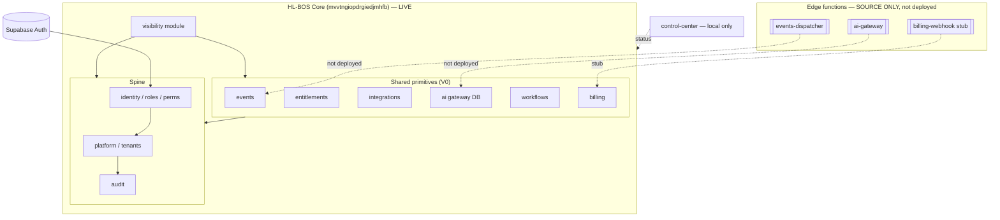

# Deliverable 1 — Executive Audit Summary

**Audit:** VisibilityAI Phase 0 — HL-BOS Complete Architecture Audit
**Date:** 2026-07-26
**Prepared for:** Keith (CEO / Product Owner)
**Method:** read-only inspection of the repository, the live HL-BOS Core database, edge-function source, CI, and all architecture docs. Nothing was modified, deployed, or migrated.

---

## The one-paragraph answer

HL-BOS is **real, well-built, and further along than its own documentation says.** The shared foundation every Herman Legacy product is supposed to reuse — tenancy, identity, permissions, audit, entitlements, an event bus, an AI gateway, a human-approval workflow, and a reusable billing platform — is **built, live on the canonical database, and covered by 166 automated tests.** VisibilityAI already exists as a module on that foundation: it can capture a prospect, run a 16-category assessment, compute a Business Growth Score, and attach recommendations — all in the database, all reusing the shared spine. **VisibilityAI development can safely begin.** What it needs next is not a rebuild but a build-out: turn built code into running services (deploy the AI gateway and event dispatcher, grant a key), add two absent shared modules (**communications** and **storage**), and build the **website-scanning worker** and the customer-facing app. There are no duplicate foundations to consolidate inside this repository — the duplication problem lives in a separate legacy project that is out of scope and unreachable here.

## A. Current state — what HL-BOS actually contains today

- **Canonical database:** the "HL-BOS Core" Supabase project (`mvvtngiopdrgiedjmhfb`) with **17 migrations applied, 49 tables across 10 schemas**, seed data, and 1 auth user (pre-production).
- **Security posture (verified live):** 49/49 tables with RLS **enabled and FORCED**, **zero** SECURITY DEFINER functions with a mutable search_path, 58 policies, an immutable audit log, secrets stored only as Vault references, and **zero** ERROR-level security advisories.
- **Built shared services:** tenancy, identity, roles/permissions, audit, events (outbox), entitlements, integrations registry, AI gateway (DB layer), workflows/human-gate, and a full reusable billing platform.
- **VisibilityAI module:** prospects → assessments → weighted scoring → recommendations, plus sites/content/reviews with a publish gate and anti-fabrication guarantees.
- **One application:** the CEO Development Control Center (`apps/control-center`), deliberately local-only.
- **Tests:** 18 (17 pgTAP files, 166 assertions, + 1 concurrency race), run in CI on every PR.

## B. Strongest existing assets — what VisibilityAI can immediately reuse

1. **The authorization core** — permission-based RLS, tenant-id-as-filter-never-proof, no-escalation rule. Best-in-class; reuse unchanged.
2. **One-model multi-tenancy** — agencies and their clients are both `platform.tenants`; conversion links them. No duplication.
3. **The assessment engine** — the VisibilityAI "front door" is already built and honest (score derives only from real inputs).
4. **The AI gateway + budgets + honest run ledger** — every model call is a real, costed, tenant-scoped row.
5. **The event bus + workflow gate** — the exact pattern needed for scans, report generation, and human approvals.
6. **The billing platform** — subscriptions grant entitlements automatically; a "customer" is just a tenant.

## C. Critical gaps — what is absent, incomplete, or not yet running

- **Communications** (email/SMS/notifications) — **does not exist.** Blocks proposal delivery and client messaging.
- **Storage/documents** — **does not exist.** Blocks proposals, agreements, screenshots.
- **Website scanning** — **does not exist.** Assessments are scored by hand today; this is the core VisibilityAI capability to build.
- **Nothing is deployed to run:** 0 edge functions deployed (AI gateway, event dispatcher are written but inert); `pg_cron`/`pg_net` not installed; no live AI key; Stripe adapter is a stub.
- **No deploy governance:** the 17 migrations were applied out-of-band; CI has no deploy job and no protected apply workflow exists yet.
- **No customer-facing app and no hosting decision.**

## D. Duplicate systems — what must be consolidated

**Inside this repository: none.** The code was built specifically to avoid duplicate foundations, and the live catalog confirms a single implementation of each concept. The only duplication in the Herman Legacy estate (two legacy tenancy models in `hlvs`/`hscs_glp`) lives in a **separate, unreachable, out-of-scope legacy project** and is explicitly _not_ a VisibilityAI prerequisite. The real forward risk is _creating_ duplication by building ad-hoc email/storage — which is exactly why communications and storage should be built once, as shared modules (Decision D-3).

## E. VisibilityAI readiness

> **Development may begin — with the restrictions in Deliverable 12.** The foundation and VisibilityAI's data/logic core are built, deployed to the canonical DB, and tested. The remaining work builds on that foundation; none of it requires reworking it.

## F. Required CEO decisions (the ones that matter)

| ID       | Decision                                                                                   | Needed before dev?         |
| -------- | ------------------------------------------------------------------------------------------ | -------------------------- |
| **D-1**  | Bless `mvvtngiopdrgiedjmhfb` as canonical; retire the empty project; fix `environments.md` | **Yes**                    |
| **D-3**  | Build `communications` + `storage` as shared modules before features that need them        | For those features         |
| **D-5**  | Deploy the AI gateway and grant an Anthropic key (Vault)                                   | Before real AI output      |
| **D-9**  | Build the protected migration/deploy workflow before customer data                         | Before go-live             |
| **D-10** | Choose where the customer-facing app is hosted                                             | Before first external user |

Full list (D-1…D-10) in Deliverable 11.

## G. Recommended next assignment

> **"VisibilityAI Phase 1 — Enablement & first shared modules."**
>
> 1. Reconcile the canonical Supabase project and correct `environments.md`; add a protected migration-apply workflow to CI (D-1, D-9).
> 2. Deploy `ai-gateway` and `events-dispatcher`; install `pg_cron`/`pg_net`; grant an Anthropic key in Vault and activate the provider (D-5, D-8).
> 3. Build the shared **`storage`** module (Supabase buckets + `storage_meta` schema, tenant-scoped, audited) and the shared **`communications`** module (schema + Twilio/email adapters via the integrations registry, consent + human-gate on send) (D-3).
> 4. Build the **website-scanning worker** (edge function on the event pipeline) that feeds the existing assessment engine, with SSRF/abuse controls designed in from day one.
>    Each step ends in a working, tested capability — not a document — per the operating contract.

---

## Appendix — required system diagrams

### 1. Current HL-BOS system architecture



### 2. Current repository and application relationships

```mermaid
graph LR
    subgraph Repo["KeithVenuewise73/hl-bos-platform (main)"]
        subgraph apps
            CC[apps/control-center\n@hl-bos/control-center\nLOCAL ONLY]
        end
        subgraph packages
            CFG[packages/config\n@hl-bos/config]
        end
        subgraph supabase
            MIG[migrations 0001-0017]
            FN[functions: ai-gateway,\nbilling-webhook, events-dispatcher]
            TST[tests: 17 pgTAP + fixtures]
        end
        CI[.github/workflows/ci.yml\nvalidate·secret-scan·db-tests·migrations]
        SC[scripts: check-migrations,\ncontrol-center.bat, local-test]
    end
    CC --> CFG
    CC -.reads.-> MIL[(.hlbos/milestone.json)]
    MIG --> DBP[(HL-BOS Core DB)]
    CI --> MIG
    CI --> TST
    SC --> MIG
    CC -. no deploy pipeline .- DBP
```

_(Diagrams for the database ERD, shared-service dependencies, product-to-service map, duplication map, VisibilityAI integration, module dependencies, scan-processing workflow, and proposal-to-implementation handoff appear in Deliverables 4, 5, 6, 7, and 10 respectively.)_
