# Deliverable 4 — Database Architecture Inventory

**Audit:** VisibilityAI Phase 0 — HL-BOS Architecture Audit
**Date:** 2026-07-26
**Scope of this document:** the canonical **HL-BOS Core** Supabase project (`mvvtngiopdrgiedjmhfb`), verified against the 17 migrations in `supabase/migrations/`.
**Method:** every count below was read from the live database catalog with read-only `execute_sql` and cross-checked against migration source. Nothing was modified.

> **Canonical-project note.** Two Supabase projects are reachable from this session's token: `mvvtngiopdrgiedjmhfb` ("HL-BOS Core") and `ywrzgursvdowzyhipsmt` ("keith@venuewise.net's Project"). Migrations `hlbos_0007`/`hlbos_0008` name `mvvtngiopdrgiedjmhfb` explicitly as the project they were reconciled from, and it carries exactly the repo's 17 migrations. **HL-BOS Core is canonical.** The legacy 156-table project described in `docs/architecture/current-state-audit.md` (`bkfsjhhclbqrhaolvhmz`) is **not reachable** from this token and is out of scope per `CLAUDE.md`. See Deliverable 11, Decision D-1.

---

## 1. Schema inventory

10 application schemas, all created by migration, none exposed through PostgREST (`config.toml` `api.schemas = ["public"]`). `public` holds no HL-BOS objects.

| Schema         | Migration  | Tables | Purpose                                                                  |
| -------------- | ---------- | -----: | ------------------------------------------------------------------------ |
| `platform`     | 0001–0008  |      1 | Tenants and platform-level lifecycle                                     |
| `identity`     | 0002–0006  |      8 | Profiles, memberships, roles, permissions, invitations, platform admins  |
| `audit`        | 0004       |      2 | Append-only audit + security events                                      |
| `events`       | 0009       |      3 | Transactional outbox event bus                                           |
| `entitlements` | 0010       |      4 | Feature catalog, plan mapping, tenant entitlements, module activation    |
| `integrations` | 0011       |      5 | Connector registry, per-tenant connections, sync runs, webhooks          |
| `ai`           | 0012       |      7 | Provider/model registry, prompt library, run ledger, budgets, guardrails |
| `workflows`    | 0013       |      3 | Human-approval gate (instances, tasks, approvals)                        |
| `visibility`   | 0014, 0017 |      8 | VisibilityAI: sites, content, reviews, prospects, assessments            |
| `billing`      | 0015–0016  |      8 | Reusable subscription platform (catalog + lifecycle)                     |

**Verified totals (live catalog):** 49 tables · 58 RLS policies · 54 routines · 42 non-internal triggers.

### 1.1 Security posture (verified, all 49 tables)

| Control                                                     | Result                                                              |
| ----------------------------------------------------------- | ------------------------------------------------------------------- |
| RLS **enabled**                                             | 49 / 49 (100%)                                                      |
| RLS **FORCED** (owner also subject to RLS)                  | 49 / 49 (100%)                                                      |
| Tables with RLS on but **no policy** (fail-closed)          | 2 — `ai.guardrails`, `integrations.webhook_events`                  |
| `SECURITY DEFINER` functions with **mutable** `search_path` | **0**                                                               |
| Advisor **ERROR**-level findings                            | 0                                                                   |
| Advisor **WARN**                                            | 2 (`pgtap` in `public` schema; leaked-password protection disabled) |
| Advisor **INFO**                                            | 2 (the two intentional no-policy tables above)                      |

This is the inverse of the legacy project's posture (15 `USING(true)` tables, 2,481 anon-writable rows). The RLS coverage is enforced in code by `audit.verify_rls_coverage()` (migration 0004) and asserted by pgTAP test `05_bootstrap_and_coverage.sql`.

---

## 2. Table inventory

`T` = tenant key present. All PKs are `uuid` (`gen_random_uuid()`) unless noted; append-only ledgers use `bigint generated always as identity` (documented deviation, migration 0004).

### platform

| Table     | PK   | Tenant key        | Notes                                                                                                |
| --------- | ---- | ----------------- | ---------------------------------------------------------------------------------------------------- |
| `tenants` | uuid | — (is the tenant) | `tenant_class` (first_party/customer), `parent_tenant_id`, soft-deactivation only (no DELETE policy) |

### identity

| Table              | PK                | Tenant key                     | Notes                                                         |
| ------------------ | ----------------- | ------------------------------ | ------------------------------------------------------------- |
| `profiles`         | = `auth.users.id` | `default_tenant_id` (non-auth) | No second user table; PK is the auth user                     |
| `memberships`      | uuid              | `tenant_id` T                  | Unique `(tenant_id,user_id)`; partial index on active-by-user |
| `invitations`      | uuid              | `tenant_id` T                  | Selector/verifier split; raw token never stored               |
| `roles`            | citext key        | —                              | Static catalog, 8 rows                                        |
| `permissions`      | citext key        | —                              | Static catalog, 43 rows                                       |
| `role_permissions` | (role,perm)       | —                              | 125 grants; scope-match trigger                               |
| `membership_roles` | (membership,role) | via membership                 | Tenant-scoped roles only (trigger)                            |
| `platform_admins`  | user_id           | — (platform)                   | Separate table, not a sentinel tenant                         |

### audit

| Table             | PK     | Tenant key           | Notes                                                                                               |
| ----------------- | ------ | -------------------- | --------------------------------------------------------------------------------------------------- |
| `events`          | bigint | `tenant_id` nullable | Append-only; write-only via `audit.emit()` trigger; immutability trigger blocks even `service_role` |
| `security_events` | bigint | `tenant_id` nullable | Denials/admin actions; read requires `platform.audit.read`                                          |

### events

| Table           | PK         | Tenant key           | Notes                                             |
| --------------- | ---------- | -------------------- | ------------------------------------------------- |
| `outbox`        | bigint     | `tenant_id` nullable | Written in producer tx via `events.emit()`        |
| `subscriptions` | citext key | —                    | Static consumer catalog                           |
| `deliveries`    | bigint     | via outbox           | One row per (outbox, subscription); at-least-once |

### entitlements

| Table                 | PK              | Tenant key    | Notes                                               |
| --------------------- | --------------- | ------------- | --------------------------------------------------- |
| `features`            | citext key      | —             | Global feature catalog (3 rows, all `visibility.*`) |
| `plan_features`       | (plan,feature)  | —             | Soft link to `billing.plans.key`                    |
| `tenant_entitlements` | uuid            | `tenant_id` T | Source = plan/trial/grant; honors expiry            |
| `module_activations`  | (tenant,module) | `tenant_id` T | Per-tenant module on/off                            |

### integrations

| Table            | PK         | Tenant key    | Notes                                                                                    |
| ---------------- | ---------- | ------------- | ---------------------------------------------------------------------------------------- |
| `connectors`     | citext key | —             | Catalog (5 rows: google_business, google_search_console, pagespeed, review_source, mock) |
| `connections`    | uuid       | `tenant_id` T | `credential_ref` constrained to `vault:` form                                            |
| `sync_runs`      | bigint     | `tenant_id` T | Honest sync instrumentation                                                              |
| `webhooks`       | uuid       | —             | `secret_ref` vault-constrained; platform-read only                                       |
| `webhook_events` | bigint     | —             | No policy (fail-closed)                                                                  |

### ai

| Table             | PK         | Tenant key           | Notes                                            |
| ----------------- | ---------- | -------------------- | ------------------------------------------------ |
| `providers`       | citext key | —                    | Vault credential refs; anthropic seeded INACTIVE |
| `models`          | citext key | —                    | Per-token pricing                                |
| `prompts`         | citext key | —                    | Prompt library head                              |
| `prompt_versions` | uuid       | —                    | Versioned templates                              |
| `runs`            | bigint     | `tenant_id` T        | AI-action ledger: real tenant/tokens/cost        |
| `budgets`         | uuid       | `tenant_id` T        | Spend caps, `within_budget()` gate               |
| `guardrails`      | uuid       | `tenant_id` nullable | No policy (fail-closed)                          |

### workflows

| Table       | PK   | Tenant key    | Notes                                               |
| ----------- | ---- | ------------- | --------------------------------------------------- |
| `instances` | uuid | `tenant_id` T | A gated process (e.g. `visibility.content.publish`) |
| `tasks`     | uuid | `tenant_id` T | Assigned by role                                    |
| `approvals` | uuid | `tenant_id` T | The human decision record                           |

### visibility

| Table                   | PK         | Tenant key             | Notes                                                              |
| ----------------------- | ---------- | ---------------------- | ------------------------------------------------------------------ |
| `sites`                 | uuid       | `tenant_id` T          | Managed properties                                                 |
| `content_assets`        | uuid       | `tenant_id` T          | Cannot publish without an approval instance (CHECK + gate)         |
| `reviews`               | uuid       | `tenant_id` T          | **No tenant write path** — cannot be fabricated                    |
| `prospects`             | uuid       | `tenant_id` T (agency) | Front-door lead; `converted_tenant_id` links to provisioned client |
| `assessment_categories` | citext key | —                      | 16 weighted dimensions (seeded)                                    |
| `assessments`           | uuid       | `tenant_id` T          | Business Growth Score baseline record                              |
| `assessment_scores`     | bigint     | via assessment         | 0–5 per category                                                   |
| `recommendations`       | bigint     | via assessment         | strength/weakness/quick_win/action_90d/service/software            |

### billing

| Table             | PK         | Tenant key    | Notes                                                   |
| ----------------- | ---------- | ------------- | ------------------------------------------------------- |
| `providers`       | citext key | —             | Vault credential + webhook-secret refs; stripe INACTIVE |
| `products`        | citext key | —             | Tagged with consuming `module`                          |
| `plans`           | citext key | —             | `key` == `entitlements.plan_features.plan_key`          |
| `plan_prices`     | uuid       | —             | Minor units (cents); provider price ref                 |
| `subscriptions`   | uuid       | `tenant_id` T | Lifecycle; drives entitlement reconcile                 |
| `invoices`        | uuid       | `tenant_id` T | **No tenant write path** (anti-fabrication)             |
| `payments`        | uuid       | `tenant_id` T | **No tenant write path** (anti-fabrication)             |
| `payment_methods` | uuid       | `tenant_id` T | Provider token refs only (PCI-safe)                     |

---

## 3. Relationship map (Mermaid ERD)

Foreign-key relationships across the spine and domains. `auth.users` is Supabase-managed; every user reference points at it (no second identity store).

```mermaid
erDiagram
    auth_users ||--o| identity_profiles : "id = id"
    auth_users ||--o{ identity_memberships : user_id
    platform_tenants ||--o{ identity_memberships : tenant_id
    platform_tenants ||--o| platform_tenants : parent_tenant_id
    identity_memberships ||--o{ identity_membership_roles : membership_id
    identity_roles ||--o{ identity_membership_roles : role_key
    identity_roles ||--o{ identity_role_permissions : role_key
    identity_permissions ||--o{ identity_role_permissions : permission_key
    identity_roles ||--o{ identity_platform_admins : role_key
    platform_tenants ||--o{ identity_invitations : tenant_id
    identity_roles ||--o{ identity_invitations : role_key

    platform_tenants ||--o{ audit_events : tenant_id
    platform_tenants ||--o{ events_outbox : tenant_id
    events_outbox ||--o{ events_deliveries : outbox_id
    events_subscriptions ||--o{ events_deliveries : subscription_key

    platform_tenants ||--o{ entitlements_tenant_entitlements : tenant_id
    entitlements_features ||--o{ entitlements_tenant_entitlements : feature_key
    entitlements_features ||--o{ entitlements_plan_features : feature_key
    platform_tenants ||--o{ entitlements_module_activations : tenant_id

    platform_tenants ||--o{ integrations_connections : tenant_id
    integrations_connectors ||--o{ integrations_connections : connector_key
    integrations_connectors ||--o{ integrations_sync_runs : connector_key

    ai_providers ||--o{ ai_models : provider_key
    ai_prompts ||--o{ ai_prompt_versions : prompt_key
    platform_tenants ||--o{ ai_runs : tenant_id
    platform_tenants ||--o{ ai_budgets : tenant_id

    platform_tenants ||--o{ workflows_instances : tenant_id
    workflows_instances ||--o{ workflows_tasks : instance_id
    workflows_tasks ||--o{ workflows_approvals : task_id

    platform_tenants ||--o{ visibility_sites : tenant_id
    visibility_sites ||--o{ visibility_content_assets : site_id
    ai_runs ||--o| visibility_content_assets : ai_run_id
    workflows_instances ||--o| visibility_content_assets : approval_instance_id
    platform_tenants ||--o{ visibility_prospects : tenant_id
    visibility_prospects ||--o{ visibility_assessments : prospect_id
    visibility_assessments ||--o{ visibility_assessment_scores : assessment_id
    visibility_assessment_categories ||--o{ visibility_assessment_scores : category_key
    visibility_assessments ||--o{ visibility_recommendations : assessment_id
    visibility_prospects ||--o| platform_tenants : converted_tenant_id

    billing_products ||--o{ billing_plans : product_key
    billing_plans ||--o{ billing_plan_prices : plan_key
    billing_providers ||--o{ billing_plan_prices : provider_key
    platform_tenants ||--o{ billing_subscriptions : tenant_id
    billing_plans ||--o{ billing_subscriptions : plan_key
    billing_subscriptions ||--o{ billing_invoices : subscription_id
    billing_invoices ||--o{ billing_payments : invoice_id
    billing_plans ||--o{ entitlements_plan_features : "key = plan_key"
```

---

## 4. RLS status and policy shape

**Policy design (consistent across all schemas):**

- Reads: `identity.is_member(tenant_id)` or `identity.has_permission(tenant_id, '<perm>')`.
- Sensitive writes: **no direct write policy** — mutations go through `SECURITY DEFINER` RPCs that re-check permission, entitlement and workflow gates.
- Static catalogs (`roles`, `permissions`, `features`, `connectors`, `products`, `plans`, `assessment_categories`) are `SELECT using (true)` to authenticated with **no write policy** — they change only by migration. This is the one deliberate `using(true)` exception, documented in migration 0003.

**Full policy matrix** is maintained at `docs/security/rls-policy-matrix.md` (spine) and is extended per-migration for the domain schemas. See Deliverable 9 for the security reading.

### 4.1 Authorization helper functions (the core of RLS)

All `SECURITY DEFINER`, all `set search_path = ''`, all containing `auth.uid()`; `p_tenant` is always a filter, never proof.

| Function                                      | Returns    | Role                                                                                   |
| --------------------------------------------- | ---------- | -------------------------------------------------------------------------------------- |
| `identity.is_member(uuid)`                    | bool       | Active membership in tenant                                                            |
| `identity.has_permission(uuid, citext)`       | bool       | **The** authorization check (active membership + operable tenant + granted permission) |
| `identity.my_tenant_ids()`                    | setof uuid | Tenant switcher source                                                                 |
| `identity.is_platform_admin()`                | bool       | Platform authority                                                                     |
| `identity.has_platform_permission(citext)`    | bool       | Platform-scoped permission                                                             |
| `identity.can_grant_role(uuid, citext)`       | bool       | No-escalation rule (subset check)                                                      |
| `platform.tenant_is_operable(uuid)`           | bool       | Suspended/deactivated tenants deny all                                                 |
| `entitlements.has_feature(uuid, citext)`      | bool       | Feature gate (fails closed)                                                            |
| `entitlements.module_is_active(uuid, citext)` | bool       | Module gate                                                                            |
| `ai.within_budget(uuid)`                      | bool       | Spend gate                                                                             |
| `workflows.is_approved(uuid)`                 | bool       | Human-gate check                                                                       |

---

## 5. Functions, triggers, enums

- **Routines:** 54 total. Every SECURITY DEFINER function pins `search_path` (verified 0 exceptions). Controlled entry points: `platform.provision_tenant()`, `identity.accept_invitation()`, `platform.bootstrap_first_platform_owner()` (owner-only, self-disarming).
- **Triggers:** 42 non-internal. Three classes — `platform.set_updated_at()` (updated_at maintenance), `audit.emit()` (append-only audit on tenant-sensitive tables), scope-guard triggers (role/permission scope enforcement), and `audit.reject_mutation()` (immutability, catches even BYPASSRLS roles).
- **Enums:** ~25 across schemas (e.g. `platform.tenant_status`, `platform.tenant_class`, `identity.role_scope`, `audit.actor_type/severity/outcome`, `billing.subscription_status/invoice_status/payment_status`, `visibility.content_status/prospect_stage/assessment_status/recommendation_kind`).
- **Indexes:** partial indexes on hot paths (`memberships_active_by_user_idx`, `outbox_unpublished_idx`, `deliveries_pending_idx`, `tenants_first_party_idx`).

---

## 6. Extensions, realtime, cron, storage

| Capability           | State (verified)                                                                                                                           | Evidence                                      |
| -------------------- | ------------------------------------------------------------------------------------------------------------------------------------------ | --------------------------------------------- |
| `pgcrypto`, `citext` | Installed (schema `extensions`)                                                                                                            | migration 0001                                |
| `pgtap`              | Installed (in `public` — advisor WARN)                                                                                                     | migration 0001; advisor                       |
| `pg_cron`            | **Not installed** in migrations (noted "available on HL-BOS Core, wired at deploy")                                                        | migration 0009 header                         |
| `pg_net`             | **Not installed**                                                                                                                          | migration 0009 header                         |
| Realtime             | Not configured for any HL-BOS table                                                                                                        | no `supabase_realtime` publication membership |
| Storage buckets      | **None created**                                                                                                                           | no storage migration; see gap below           |
| Cron jobs            | **None**                                                                                                                                   | `pg_cron` absent                              |
| Secrets (`vault`)    | Referenced by name only (`vault:anthropic_api_key`, `vault:stripe_secret_key`, `vault:stripe_webhook_secret`); no values in repo or tables | migrations 0012/0015                          |

---

## 7. Duplicate-concept scan (as required by the brief §7)

Searched specifically for the overlapping concepts the brief names. **Within HL-BOS Core the design is deliberately non-duplicative** — this is its defining strength.

| Concept pair to check               | Finding in HL-BOS Core                                                                                                                                 |
| ----------------------------------- | ------------------------------------------------------------------------------------------------------------------------------------------------------ |
| organization **vs** tenant          | **Single concept.** Only `platform.tenants`. No `organizations` table.                                                                                 |
| user profile **vs** contact         | `identity.profiles` (PK = `auth.users.id`). Prospects/contacts are `visibility.prospects` (CRM lead), a distinct domain, not a second identity store.  |
| customer **vs** account             | **Single concept.** A "customer" is a `platform.tenants` row; billing adds none of its own (migration 0015 header).                                    |
| lead **vs** prospect                | Single: `visibility.prospects` with a `stage` enum (`prospect→assessed→proposed→client→lost`).                                                         |
| subscription **vs** plan assignment | `billing.subscriptions` (lifecycle) vs `billing.plans`/`plan_features` (catalog). Cleanly separated; sub grants features via `reconcile_entitlements`. |
| feature **vs** entitlement          | `entitlements.features` (catalog) vs `tenant_entitlements` (grant). Intended two-table split, not duplication.                                         |
| notification **vs** message         | **Neither built.** No `communications`/`notifications` schema exists yet. (Gap, not duplicate.)                                                        |
| activity **vs** audit event         | Only `audit.events`. No separate activity feed.                                                                                                        |
| appointment **vs** calendar event   | Neither exists (no vertical scheduling built).                                                                                                         |
| document **vs** file asset          | Neither exists (no `storage` schema built). `visibility.content_assets` is content, not files.                                                         |
| workflow **vs** task                | `workflows.instances` (process) + `workflows.tasks` (step) — intended parent/child, not duplication.                                                   |
| AI request **vs** AI conversation   | Only `ai.runs` (per-call ledger). No conversation store yet.                                                                                           |

**Conclusion:** there are **no intra-repo duplicate foundations.** The only "duplication" in the Herman Legacy estate is between HL-BOS Core and the **legacy** project's `hlvs`/`hscs_glp` schemas — which are unreachable here and out of scope. See Deliverable 7.

---

## 8. Gaps (capabilities the brief expects that the schema does not yet contain)

| Missing capability                                  | Evidence of absence                                                            | VisibilityAI impact                                                           |
| --------------------------------------------------- | ------------------------------------------------------------------------------ | ----------------------------------------------------------------------------- |
| **Communications** (email/SMS/Twilio/notifications) | No `communications` schema; `.env.example` defers Twilio/email to later phases | High — proposal delivery, missed-call text-back, client comms                 |
| **Storage/documents** (buckets, file metadata)      | No storage migration; zero buckets                                             | High — proposals, screenshots, signed agreements, brand assets                |
| **Reporting/analytics** (aggregates, KPIs)          | No reporting schema; `audit`/`ai.runs` are the only ledgers                    | Medium — client dashboards, monthly reporting (assessment record is the seed) |
| **Scheduled processing** (`pg_cron`/`pg_net`)       | Not installed; dispatch is manual/edge-triggered                               | High — website scans, report generation, dunning                              |
| **Website scanning** (fetch/analyze pipeline)       | No scan tables; assessments are **manually scored** today                      | High — the core VisibilityAI capability                                       |
| **Deployed edge functions**                         | 0 deployed (3 in source)                                                       | High — ai-gateway/events-dispatcher must be deployed to run                   |

These are **absences to be built**, not duplicates to consolidate. See Deliverables 8 and 10.
