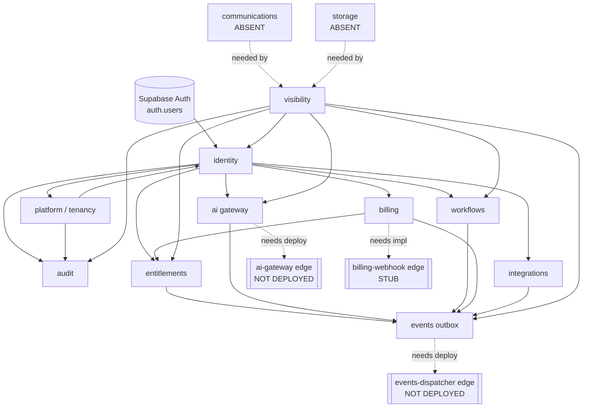

# Deliverable 5 — Shared Service Audit

**Audit:** VisibilityAI Phase 0
**Date:** 2026-07-26

For each domain: implementation, location, DB objects, consumers, security controls, tests, gaps, duplication risk, VisibilityAI reuse recommendation. All claims are evidenced against migrations and the live HL-BOS Core catalog.

---

## 5.1 Identity & Authentication

- **Implementation:** Supabase Auth is the sole identity provider. `identity.profiles.id` **is** `auth.users.id` — no second user table, no second password system. Invitations use a selector/verifier split; the raw token is never stored; acceptance is token-authorized (constant-time compare), not permission-authorized (owner ruling 2026-07-15).
- **Location:** `identity` schema (mig 0002, 0006); `platform.bootstrap_first_platform_owner` (0006).
- **DB objects:** `profiles`, `memberships`, `invitations`, `platform_admins`; `accept_invitation()`, `bootstrap_first_platform_owner()`.
- **Consumers:** every module (via `auth.uid()` in helpers).
- **Security:** service_role cannot bootstrap a platform owner (leaked-key defense); email confirmation required; RLS FORCED on all identity tables.
- **Tests:** `04_invitations` (13), `05_bootstrap_and_coverage` (14), concurrency race (1).
- **Gaps:** no MFA configured; leaked-password protection disabled (advisor WARN); no self-serve password-reset flow wired (Supabase built-in available).
- **Duplication risk:** none in-repo. Canonical.
- **VisibilityAI:** **Reuse unchanged.** Canonical source of identity.

## 5.2 Organizations & Multi-Tenancy

- **Implementation:** one concept — `platform.tenants` — for both Herman Legacy companies (`tenant_class=first_party`) and external customers (`customer`), with optional `parent_tenant_id` hierarchy. Membership is many-to-many via `identity.memberships` (tenant switching supported). Soft-deactivation only.
- **Location:** `platform` (mig 0002/0007/0008).
- **DB objects:** `tenants`; `provision_tenant()` (atomic tenant+owner+role), `tenant_is_operable()`, `enforce_tenant_class_managed()` trigger.
- **Security:** no INSERT policy on `tenants` (creation only via `provision_tenant`); a tenant cannot change its own class/parent; suspended tenants deny all access to every role.
- **Tests:** `01_tenant_isolation` (12), `03_provisioning` (9), `08_tenant_class` (10).
- **Gaps:** none material.
- **Duplication risk:** none in-repo. (Legacy `hlvs`/`hscs_glp` `organizations` are the historical duplicates — out of scope.)
- **VisibilityAI:** **Reuse unchanged.** Agencies and their clients are both tenants; the prospect→client conversion links `converted_tenant_id`.

## 5.3 Roles & Permissions

- **Implementation:** permission-based, not role-name-based. Policies test `has_permission(tenant, 'x.y.z')`; roles are bundles of permissions (rows, not code). Closed action vocabulary; no implicit hierarchy. No-escalation rule (`can_grant_role`) prevents granting authority you don't hold. Scope-guard triggers keep tenant/platform permissions from crossing.
- **Location:** `identity` (mig 0003/0005).
- **DB objects:** `roles`(8), `permissions`(43), `role_permissions`(125), `membership_roles`; helper fns.
- **Security:** helpers `SECURITY DEFINER`, `search_path=''`, `auth.uid()` always present, `p_tenant` a filter never proof; live in non-API schema (never PostgREST-exposed).
- **Tests:** `02_audit_and_access` (17), `07_privilege_escalation` (8).
- **Gaps:** none material; permission vocabulary grows per module (43 now).
- **Duplication risk:** none. **Centralized** — this is the single authorization core.
- **VisibilityAI:** **Reuse + extend** (add `visibility.*` permissions as already done in 0014/0017).

## 5.4 Billing & Subscriptions

- **Implementation:** reusable subscription platform. Catalog (`providers`/`products`/`plans`/`plan_prices`) + lifecycle (`subscriptions`/`invoices`/`payments`/`payment_methods`). `plan.key == entitlements.plan_features.plan_key`, so subscribing grants features with no duplicate entitlement logic (`reconcile_entitlements`). Anti-fabrication: invoices/payments have **no tenant write path**. Refunds pass the human gate. Money in minor units; provider credentials are Vault refs; card data never stored (token refs only).
- **Location:** `billing` (mig 0015/0016); `functions/billing-webhook` (stub); `_shared/billing/*`.
- **Consumers:** SalonAI/HomeHuddle seeded as **catalog examples only** (no live subscriptions; 0 rows).
- **Security:** provider-side writes gated to platform admin; stripe seeded INACTIVE.
- **Tests:** `16_billing_core` (9), `17_billing_subscriptions` (14).
- **Gaps:** Stripe adapter is a **stub**; webhook not deployed; no live subscription exercised.
- **Duplication risk:** none in-repo (a "customer" is a tenant; billing adds no identity).
- **VisibilityAI:** **Reuse + repair** — reuse the engine for client subscriptions after conversion; implement the Stripe adapter + deploy the webhook.

## 5.5 Feature Entitlements & Plans

- **Implementation:** `has_feature()` gate consulted by modules; `module_activations` toggles a module per tenant; grants sourced from plan/trial/manual; honors expiry; fails closed. Enforced in the database (RPCs check `has_feature`/`module_is_active`), not only UI.
- **Location:** `entitlements` (mig 0010).
- **DB objects:** `features`(3 visibility features seeded), `plan_features`, `tenant_entitlements`, `module_activations`.
- **Tests:** `11_entitlements` (7).
- **Gaps:** activation is platform-admin-only (no self-serve trial start yet); usage-metering/limits not modeled.
- **Duplication risk:** none. Canonical.
- **VisibilityAI:** **Reuse unchanged** — `visibility.core/content/reputation` features already seeded.

## 5.6 CRM & Relationship Management

- **Implementation:** VisibilityAI's `prospects` + assessment workflow is the closest thing to CRM. `prospects` holds business/contact/industry/website + a `stage` pipeline (prospect→assessed→proposed→client→lost). No generic contacts/companies/opportunities/activities tables.
- **Location:** `visibility` (mig 0017).
- **Tests:** `18_visibility_assessments` (11).
- **Gaps:** no shared CRM across products; no activities/tasks/notes/pipelines beyond the prospect stage; no lead-source tracking.
- **Duplication risk:** low today; **risk if** future verticals build their own contact stores. Recommend promoting a shared `crm` concept later, or generalizing `prospects`.
- **VisibilityAI:** **Reuse `prospects`; consider extracting a shared CRM** if a second vertical needs contacts (executive decision — see D-4).

## 5.7 Communications

- **Implementation:** **None.** No `communications`/`notifications` schema, no email/SMS/Twilio, no templates/consent/opt-out, no message history.
- **Gaps:** everything. This is the single largest foundational absence.
- **Duplication risk:** high **if** VisibilityAI builds ad-hoc email/SMS instead of a shared module.
- **VisibilityAI:** **Build new reusable `communications` module** (proposal delivery, missed-call text-back, notifications). Required for launch. See D-3.

## 5.8 Shared AI Services

- **Implementation:** one authenticated gateway. DB side (run lifecycle, budget enforcement, provider/model/prompt registry, honest cost ledger) is complete; the edge function that calls providers is scaffolded with a real Anthropic adapter (inert until a key is granted) + a mock. Every call is an `ai.runs` row with real tenant/tokens/cost; failures record a failed run, never a fabricated success.
- **Location:** `ai` (mig 0012); `functions/ai-gateway`; `_shared/ai/*`.
- **Security:** `ai.run.create` gate + budget check before any call; providers hold Vault refs; anthropic INACTIVE until key granted.
- **Tests:** `13_ai_gateway` (6).
- **Gaps:** not deployed; no live key; no embeddings/RAG, no structured-output helper, no prompt-injection guardrail engine (`ai.guardrails` table exists but has no policy/logic yet); OpenAI/Gemini adapters not written.
- **Duplication risk:** none in-repo; **must** route all VisibilityAI AI through this gateway to avoid scattering.
- **VisibilityAI:** **Reuse + extend** — deploy the gateway, grant a key, add prompts for analysis/recommendation/proposal generation. See D-5.

## 5.9 Storage & Documents

- **Implementation:** **None.** No Supabase Storage buckets, no file-metadata schema, no access policies, no retention. `visibility.content_assets` stores content **text**, not files.
- **Gaps:** everything — proposals, website screenshots, signed agreements, brand assets have nowhere to live.
- **VisibilityAI:** **Build new reusable `storage` module** (buckets + `storage_meta` metadata + tenant-scoped access + retention). Required for proposals/agreements. See D-3.

## 5.10 Audit, Security & Compliance

- **Implementation:** append-only `audit.events` (business) + `audit.security_events` (denials/admin actions), written only by internal SECURITY DEFINER paths; immutable even to `service_role`/`postgres` via a mutation-reject trigger. Attached to all sensitive tables.
- **Location:** `audit` (mig 0004), triggers across schemas.
- **Coverage (verified):** 42 triggers; audit on tenants, memberships, roles, invitations, platform_admins, entitlements, integrations, workflows, billing, visibility.
- **Tests:** `02_audit_and_access` (17).
- **Gaps:** **denials are not audited in-database** (documented limitation — RAISE rolls back the log row; owner decision pending on API-layer logging); no rate limiting; no prompt-injection protection; no consent/retention records.
- **VisibilityAI:** **Reuse unchanged**; address denial-logging + rate-limiting at the API layer when built. See D-6.

## 5.11 Reporting & Analytics

- **Implementation:** **None as a shared service.** The only aggregatable ledgers are `ai.runs` (cost/usage) and `audit.events`. VisibilityAI's `assessments` are structured data explicitly designed to become the baseline for monthly reporting.
- **Gaps:** no metrics/KPI tables, no dashboards, no aggregation.
- **VisibilityAI:** **Build new `reporting` module later**; seed from `assessments`. Not required for launch (defer). See D-7.

## 5.12 Notifications & Background Processing

- **Implementation:** the transactional outbox (`events`) is the async backbone; `dispatch_batch()` is written and pgTAP-tested. Production wiring (pg_cron → pg_net → edge dispatcher) is a **deploy concern not yet done**; `pg_cron`/`pg_net` are available on HL-BOS Core but not installed.
- **Location:** `events` (mig 0009); `functions/events-dispatcher` (not deployed).
- **Gaps:** no scheduler running; no retry/dead-letter handler wired (delivery `status` enum includes `failed`/`dead` but the retry loop lives in an undeployed handler); notifications channel absent (needs communications).
- **VisibilityAI:** **Reuse + deploy** — this is exactly the architecture for website scans and report generation: emit an event, dispatch to a worker. Install pg_cron/pg_net and deploy the dispatcher. See D-8.

## 5.13 Integration Management

- **Implementation:** one connector shape — catalog + per-tenant connection (Vault credential ref, enforced by CHECK) + logged sync runs + webhook registry. Seeded connectors: google_business, google_search_console, pagespeed, review_source, mock.
- **Location:** `integrations` (mig 0011).
- **Security:** credentials are `vault:` references only (constraint-enforced); connections tenant-scoped; webhooks platform-only.
- **Tests:** `12_integrations` (7).
- **Gaps:** framework only — no live OAuth flow, no connector implementation code, `webhook_events` has no policy (fail-closed).
- **VisibilityAI:** **Reuse + extend** — implement the Google/PageSpeed/review connectors on this registry rather than a new one.

## 5.14 Deployment & Environments

See Deliverable 2 §5–6. Summary: intended Local→Preview(branch)→Production(manual-approval) topology; **no deploy pipeline exists**; migrations landed on HL-BOS Core out-of-band; edge functions undeployed; branching not enabled; no app hosting decided.

---

## Shared-service dependency map

