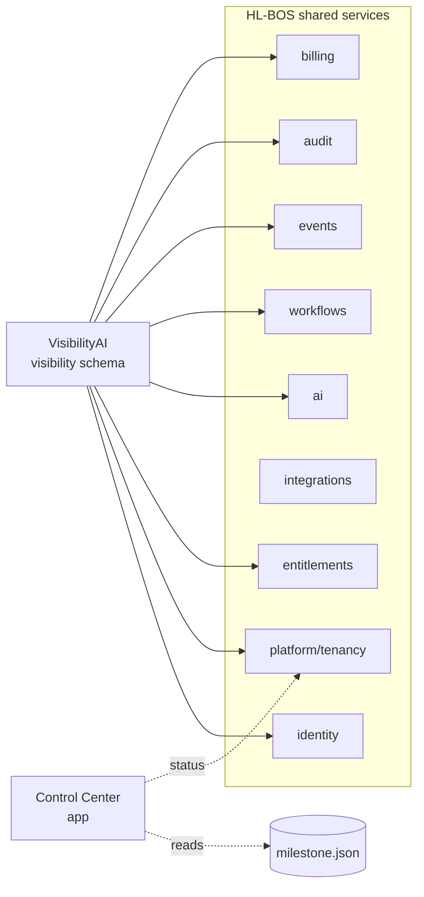

# Deliverable 6 — Product and Vertical Inventory

**Audit:** VisibilityAI Phase 0
**Date:** 2026-07-26

Status vocabulary (per brief): Production · Operational pilot · Functional development · Partial prototype · Database only · UI only · Documentation only · Planned · Deprecated · Unknown.

The authoritative in-repo product list is `apps/control-center/src/lib/registry.ts` (9 products). Products named in the audit brief but absent from the repo are recorded as **Planned / Documentation only** with that stated explicitly.

---

## 1. Products with code or schema in _this_ repo

| Product                            | Business purpose                                                              | Location                                      | DB schema                     | Shared services used                                          | Status                                                                                                                                         | Evidence                           |
| ---------------------------------- | ----------------------------------------------------------------------------- | --------------------------------------------- | ----------------------------- | ------------------------------------------------------------- | ---------------------------------------------------------------------------------------------------------------------------------------------- | ---------------------------------- |
| **HL-BOS Core**                    | The shared operating system itself                                            | `supabase/migrations/*`, whole repo           | 10 schemas (platform…billing) | — (is the platform)                                           | **Functional development** — 49 tables live on HL-BOS Core, 100% RLS, 166 pgTAP assertions passing; pre-production (1 auth user, seed only)    | migrations 0001–0017; live catalog |
| **CEO Development Control Center** | CEO's terminal-free ops console                                               | `apps/control-center`                         | reads `.hlbos/milestone.json` | git, GitHub API, Supabase Mgmt API                            | **Functional development** — built, local-only, 1 test unit                                                                                    | `apps/control-center/**`           |
| **VisibilityAI**                   | Discovery→assessment→proposal→onboarding front door for Herman Legacy Digital | `supabase/migrations/0014,0017`; `_shared/ai` | `visibility` (8 tables)       | identity, entitlements, ai, workflows, events, audit, billing | **Partial prototype (DB + workflow only)** — assessment workflow + Business Growth Score exist as RPCs; **no UI, no scanning, manual scoring** | migrations 0014/0017; test 15/18   |

## 2. Products referenced in the registry but not yet built

From `registry.ts` (`stage` field verbatim):

| Product                          | Registry stage | Reality                                                                                      | Evidence                                   |
| -------------------------------- | -------------- | -------------------------------------------------------------------------------------------- | ------------------------------------------ |
| HLVS Venture Studio              | `production`   | Lives in the **legacy** Supabase project; **not reachable** from this environment            | `registry.ts`; legacy project out of scope |
| HSCS Government Logistics        | `production`   | Legacy project (74 tables); not reachable                                                    | `registry.ts`                              |
| AI Asset Recovery (RecoveryWise) | `production`   | Legacy project; carries an open cross-tenant finding                                         | `registry.ts`, prior audit SEC-2           |
| SalonAI                          | `not-started`  | Named in billing seed (`billing.products`/`plans`) as a **catalog example**; no product code | migration 0015; `registry.ts`              |
| LandscapeAI                      | `not-started`  | Planned; no code                                                                             | `registry.ts`                              |
| FleetHuddle                      | `not-started`  | One legacy integration point; no HL-BOS code                                                 | `registry.ts`                              |
| CoachAI                          | `not-started`  | Planned; no code                                                                             | `registry.ts`                              |
| Venuewise                        | `not-started`  | Planned; no code                                                                             | `registry.ts`                              |

## 3. Products named in the brief but absent from the repo

The brief lists many verticals (BarberAI, TransportationAI, HomeHuddle, AthleteHuddle, 5-Star Sports Media, HSCS Consulting, HSCS Government Logistics, ContractorAI, Reputation Management, Marketing Automation, AI Receptionist, Relationship Intelligence, Executive Dashboard, Website hosting/builder, SEO, Review recovery, Missed-call text-back).

**Finding:** With two exceptions, none of these exist as code, schema, or documentation in this repo.

- **HomeHuddle** appears only as a **billing catalog example** (`billing.products`, `billing.plans` seed in migration 0015) — a plan definition, not a product. Status: **Planned**.
- **Reputation Management / Reviews / Missed-call text-back / SEO / Marketing Automation / AI Receptionist** appear as **assessment categories** (`visibility.assessment_categories`, migration 0017) and one feature (`entitlements.features` `visibility.reputation`) — i.e. things VisibilityAI _scores a prospect on_, not built products. Status: **Planned / Documentation only**.
- All remaining brief products: **Planned**, no trace. Recorded honestly rather than inferred.

## 4. Product → shared-service consumption (built products only)

VisibilityAI already consumes every relevant shared service through the database seam (module activation, entitlement gate, AI run ledger, workflow gate, event emits, audit triggers, billing conversion event). This is the reuse the brief asks for, demonstrated in code.

## 5. Recommended disposition

| Product                                        | Disposition                                                                                                            |
| ---------------------------------------------- | ---------------------------------------------------------------------------------------------------------------------- |
| HL-BOS Core                                    | **Extend** — continue building shared modules (communications, storage, reporting) as verticals need them              |
| VisibilityAI                                   | **Extend** the existing `visibility` schema; build UI, scanning, proposals on the shared spine — do not fork           |
| Control Center                                 | **Leave unchanged** — it is complete for its purpose; extend only as new ops actions are needed                        |
| Legacy products (HLVS, HSCS GLP, RecoveryWise) | **Out of scope / defer** — separate unreachable project; migration onto HL-BOS is a future, separately-approved effort |
| Named-but-unbuilt verticals                    | **Planned** — assemble from HL-BOS modules when prioritized; do not scaffold empty                                     |
