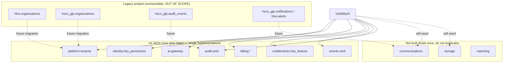

# Deliverable 7 — Duplication and Consolidation Register

**Audit:** VisibilityAI Phase 0
**Date:** 2026-07-26

**Headline finding:** within the HL-BOS Core repository there are **no duplicate foundations.** The codebase was built specifically to avoid them, and the live catalog confirms a single implementation of each concept. The duplication that exists in the broader Herman Legacy estate lives in the **legacy Supabase project** (`hlvs`/`hscs_glp` schemas), which is unreachable from this environment and out of scope per `CLAUDE.md`.

This register therefore records: (A) the near-zero intra-repo duplication, (B) the legacy-vs-core duplication that is real but out of scope, and (C) the code-pattern consolidation the repo has already achieved (evidence it is not duplicating).

---

## A. Intra-repo duplication (the thing the brief most fears)

Code-search across the repo for repeated Supabase clients, auth middleware, org resolution, role checks, billing logic, email/SMS, AI calls, file uploads, audit logging, etc. Result: each exists **once**.

| Concept                     | Canonical implementation                                                                                                              | Any duplicate? | Severity | Required before VisibilityAI? |
| --------------------------- | ------------------------------------------------------------------------------------------------------------------------------------- | -------------- | -------- | ----------------------------- |
| Supabase client creation    | control-center: Mgmt API only; edge fns: one dual-client pattern; `@hl-bos/config` is the only `process.env` reader (ESLint-enforced) | No             | —        | No                            |
| AuthZ / role checks         | `identity.has_permission()` + helpers (one place)                                                                                     | No             | —        | No                            |
| Org/tenant resolution       | `identity.is_member` / `my_tenant_ids` (one place)                                                                                    | No             | —        | No                            |
| Billing logic               | `billing` schema fns (one place)                                                                                                      | No             | —        | No                            |
| AI provider calls           | `ai-gateway` + `_shared/ai/*` (one door)                                                                                              | No             | —        | No                            |
| Email/SMS sending           | **none exists** (absence, not duplicate)                                                                                              | N/A            | —        | Build once (D-3)              |
| Audit logging               | `audit.emit()` trigger (one place)                                                                                                    | No             | —        | No                            |
| Event/notification creation | `events.emit()` (one place)                                                                                                           | No             | —        | No                            |
| File uploads                | **none exists**                                                                                                                       | N/A            | —        | Build once (D-3)              |
| Feature gates               | `entitlements.has_feature()` (one place)                                                                                              | No             | —        | No                            |
| Env/secret access           | `@hl-bos/config` (one place)                                                                                                          | No             | —        | No                            |

**Conclusion:** No in-repo consolidation is required before VisibilityAI development.

## B. Legacy ↔ Core duplication (real, but out of scope)

Recorded for completeness; verification blocked because the legacy project is unreachable. Source: `docs/architecture/current-state-audit.md` (prior audit, unverifiable here).

| Duplicate concept      | Legacy location (unreachable)                                            | HL-BOS Core canonical                              | Consolidation effort                 | Required before VisibilityAI launch?        |
| ---------------------- | ------------------------------------------------------------------------ | -------------------------------------------------- | ------------------------------------ | ------------------------------------------- |
| Tenancy model          | `hlvs.organizations` (single-org) + `hscs_glp.organizations` (multi-org) | `platform.tenants`                                 | Large (data migration, per vertical) | **No** — VisibilityAI is greenfield on Core |
| Audit                  | `hscs_glp.audit_events`                                                  | `audit.events`                                     | Medium                               | No                                          |
| Notifications          | `hscs_glp.notifications`, `hlvs.alerts`                                  | (build `communications`/`notifications`)           | Medium                               | No                                          |
| AI logs                | `hscs_glp.ai_action_logs`, `hlvs.research_runs`                          | `ai.runs`                                          | Medium                               | No                                          |
| Documents              | `hscs_glp.*_documents`, `hlvs.documents`                                 | (build `storage`)                                  | Medium                               | No                                          |
| Billing (domain AR/AP) | `hscs_glp.invoices`                                                      | `billing.*` (platform billing — different concern) | N/A (not the same thing)             | No                                          |

**Severity: informational.** These are legacy systems in a separate project with their own users. Consolidating them is a **future, separately-approved migration effort**, explicitly _not_ a VisibilityAI prerequisite. The strangler-fig plan in `target-architecture.md` was superseded by the greenfield decision (Option 2, 2026-07-15) — HL-BOS Core does **not** touch legacy.

## C. Consolidation already achieved (positive evidence)

The repo demonstrates the Rule-of-Three consolidation the brief wants, in code:

- **One authorization core** generalized from the proven `hscs_glp` pattern (documented in `target-architecture.md` §1.5), improved to permission-based checks.
- **One billing engine** serving multiple products via catalog rows (SalonAI, HomeHuddle seeded as examples, not forked code).
- **One AI gateway** in front of every model.
- **One event bus** every module writes to.
- **One config reader** (`@hl-bos/config`), enforced by an ESLint `no-restricted-properties` rule banning direct `process.env`.

## D. The one genuine "duplication risk" going forward

Not a current duplicate, but the **highest consolidation risk** for VisibilityAI:

| Risk                      | Detail                                                                                                         | Recommendation                                                                                                 |
| ------------------------- | -------------------------------------------------------------------------------------------------------------- | -------------------------------------------------------------------------------------------------------------- |
| **Ad-hoc communications** | With no shared comms module, VisibilityAI could grow its own email/SMS sending for proposals and notifications | Build the shared `communications` module **first**, before any VisibilityAI feature that sends a message (D-3) |
| **Ad-hoc file storage**   | No storage module → temptation to store proposal PDFs/screenshots ad hoc                                       | Build shared `storage` module before proposals/agreements (D-3)                                                |
| **Scattered AI calls**    | Convenience calls to Anthropic directly instead of via `ai-gateway`                                            | Enforce: all AI through `ai-gateway`; deploy it first (D-5)                                                    |
| **A second CRM**          | A future vertical building its own contacts table alongside `visibility.prospects`                             | Decide whether `prospects` generalizes into a shared `crm` (D-4)                                               |

## Duplication map

