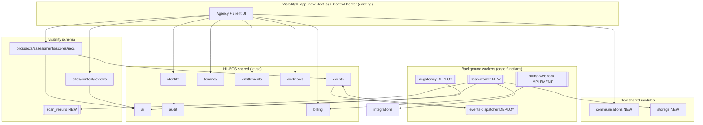

# Deliverable 10 — VisibilityAI Architecture Recommendation

**Audit:** VisibilityAI Phase 0
**Date:** 2026-07-26

---

## 1. Recommended position within HL-BOS

**VisibilityAI is an HL-BOS module, not an application.** It already lives in the `visibility` schema and consumes the shared spine. The recommendation is to **continue on that seam**: build the VisibilityAI product (UI, scanning, proposals) as a consumer of HL-BOS shared services, never as a standalone stack. This is already true in the database — the job is to keep it true as the UI and workers are added.

Concretely: one customer-facing Next.js app (new) + background workers (edge functions) + the existing `visibility` schema, all sitting on identity/tenancy/entitlements/ai/workflows/events/audit/billing.

## 2. Modules to reuse (unchanged)

`platform` (tenancy), `identity` (auth/roles/permissions), `audit`, `events`, `entitlements`, `workflows`, and the `ai`/`billing` **database** layers. Evidence and per-module notes are in Deliverables 5 and 8.

## 3. Modules to extend

- `visibility` — add scan-result tables, competitor tables, proposal records (extend, don't fork).
- `integrations` — implement the seeded connectors (PageSpeed, Google Business, review source).
- `ai` — deploy the gateway, grant a provider key, add analysis/recommendation/proposal prompts.
- `billing` — implement the Stripe adapter, deploy the webhook.

## 4. New reusable modules required

| Module                                         | Why new (no existing component)                                                                                           | Launch-required                 |
| ---------------------------------------------- | ------------------------------------------------------------------------------------------------------------------------- | ------------------------------- |
| `communications` (schema)                      | No email/SMS/notification capability exists; consent/templates/opt-out/delivery are a distinct concern from the event bus | **Yes**                         |
| `storage` (buckets + `storage_meta`)           | No file storage exists; proposals/agreements/screenshots/brand assets need a home                                         | **Yes**                         |
| Website-scanning worker (extends `visibility`) | No fetch/analyze pipeline; assessments are scored by hand today                                                           | **Yes**                         |
| `reporting` (schema)                           | No aggregation layer; client dashboards/monthly reporting                                                                 | Defer (seed from `assessments`) |

Each passes the no-duplication test in Deliverable 8.

## 5. Data ownership

- **Prospects, assessments, scores, recommendations, sites, content, reviews, scan results, proposals** → `visibility` schema (agency tenant owns them; `converted_tenant_id` links to the provisioned client tenant on conversion).
- **Identity, tenants, entitlements, billing, ai runs, workflow approvals, audit, events** → their canonical shared schemas. VisibilityAI **references** these, never copies them.
- **Files** → `storage` buckets, metadata in `storage_meta`, tenant-scoped.
- **Messages** → `communications` schema.

## 6. Service boundaries

- **Writes to sensitive tables go through SECURITY DEFINER RPCs** (the established pattern), which enforce permission + entitlement + module-active + workflow gates. The app never does privileged inserts directly.
- **AI only via `ai-gateway`.** No direct provider calls from the app.
- **Sends only via `communications`** (with consent + human-gate checks). No ad-hoc email/SMS.
- **Files only via `storage`.**
- **All async work via `events` → dispatcher → worker.**

## 7. Dependency diagram



## 8. Recommended application structure

```
apps/
  control-center/        (existing, local-only ops console)
  visibility-web/        (NEW) — Next.js; agency + client portals; Supabase Auth; @hl-bos/config
packages/
  config/                (existing)
  ui/                    (NEW, when a second app needs shared components)
supabase/
  migrations/            (extend: visibility scan tables, communications, storage_meta)
  functions/
    ai-gateway/          (DEPLOY)
    events-dispatcher/   (DEPLOY)
    billing-webhook/     (IMPLEMENT + DEPLOY)
    scan-worker/         (NEW)
    comms-dispatcher/    (NEW, sends queued messages)
```

## 9. Recommended worker architecture

Reuse the transactional-outbox pattern already built:

1. A user action (or schedule) writes domain state **and** an `events.outbox` row in one transaction.
2. `pg_cron` (install) calls `events.dispatch_batch()` (built) → writes `deliveries`.
3. `pg_net` (install) invokes the relevant edge worker (`scan-worker`, `comms-dispatcher`) per delivery.
4. Worker does its job, records honest results (scan tables, `ai.runs`, `communications.deliveries`), emits follow-on events.
5. Retries/dead-letter via the `deliveries.status` enum (`queued/failed/dead`) — implement the retry loop in the dispatcher.

This gives website scans and report generation an at-least-once, idempotent, auditable pipeline **without new infrastructure** — only `pg_cron`/`pg_net` installation and worker deployment.

## 10. Human-review checkpoints (already enforceable via `workflows`)

- AI-drafted **content** cannot publish without an approved workflow instance (built, test 15).
- **Refunds** require an approved instance (built, test 17).
- Recommended additions (define workflow `kind`s): **proposal send**, **agreement send**, **first outbound message to a prospect**, **going live with a client site change**.

## 11. Components intentionally deferred

| Deferred                                       | Why                                                                           | Revisit at                    |
| ---------------------------------------------- | ----------------------------------------------------------------------------- | ----------------------------- |
| `reporting` schema / client dashboards         | Not needed to close first deals; assessments already persist as the data seed | After first cohort of clients |
| White-label theming                            | `branding` jsonb exists; theming is a later phase per brief                   | Phase 2 of VisibilityAI       |
| Competitor-data sourcing                       | Needs a data vendor decision                                                  | Post-launch                   |
| Legacy (`hlvs`/`hscs_glp`) migration onto Core | Separate project, separate approval                                           | Independent effort            |
| OpenAI/Gemini adapters                         | Anthropic-first is sufficient                                                 | When a use case needs them    |

## 12. Recommended build sequence (architecture-level)

1. **Reconcile the canonical project + build deploy governance** (D-1, F-5) — so subsequent work lands correctly.
2. **Deploy `ai-gateway` + `events-dispatcher`; install `pg_cron`/`pg_net`; grant AI key** — turns the built DB into a running platform.
3. **Build `storage` + `communications` shared modules** — unblock proposals and delivery.
4. **Build the `scan-worker`** feeding the existing assessment/scoring/recommendation engine — the core VisibilityAI value.
5. **Build `visibility-web`** (agency portal → intake → assessment → proposal → conversion).
6. **Implement Stripe adapter + billing webhook** for client subscriptions post-conversion.
7. **Defer** reporting, white-label, competitor sourcing.

Steps 1–2 are enablement; 3–5 are the launch product; 6 monetizes; 7 is post-launch.

## 13. Recommended scan-processing workflow

```mermaid
sequenceDiagram
    participant U as Agency user
    participant DB as visibility (RPC)
    participant OB as events.outbox
    participant CR as pg_cron
    participant D as events-dispatcher
    participant SW as scan-worker
    participant INT as integrations (PageSpeed/GBP)
    participant AI as ai-gateway
    participant ST as storage
    U->>DB: create_prospect() / request scan
    DB->>OB: emit visibility.scan.requested (same tx)
    CR->>D: dispatch_batch() (scheduled)
    D->>SW: invoke per delivery (pg_net)
    SW->>INT: fetch PageSpeed / GBP / reviews
    SW->>AI: analyze content (begin_run→finish_run, honest cost)
    SW->>ST: store screenshots
    SW->>DB: write scan_results + score_category()
    SW->>OB: emit visibility.scan.completed
    Note over SW,DB: assessment auto-scored from real inputs;<br/>growth score computed by complete_assessment()
```

## 14. Recommended proposal-to-implementation handoff

```mermaid
sequenceDiagram
    participant A as Agency
    participant AS as assessment (completed)
    participant AI as ai-gateway
    participant ST as storage
    participant WF as workflows (human gate)
    participant CO as communications
    participant P as Prospect
    participant BIL as billing
    participant TEN as platform.provision_tenant
    AS->>AI: generate proposal from recommendations
    AI->>ST: store proposal PDF
    A->>WF: request approval (kind=visibility.proposal.send)
    WF-->>A: approved (human gate)
    WF->>CO: send proposal to prospect
    CO->>P: email/SMS proposal
    P->>A: accepts + pays
    A->>BIL: start_subscription() (Stripe)
    A->>TEN: provision client tenant
    A->>AS: set_prospect_stage('client', converted_tenant_id)
    Note over TEN,BIL: billing + provisioning reuse shared modules;<br/>reconcile_entitlements grants the client's features
```
