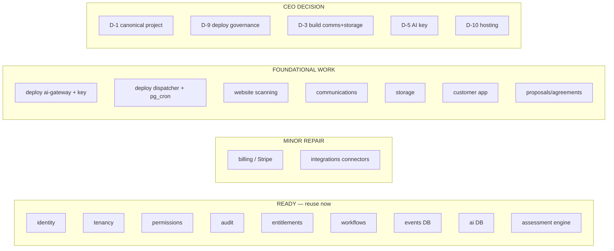

# Deliverable 12 — Implementation Readiness Report

**Audit:** VisibilityAI Phase 0
**Date:** 2026-07-26

Classification per area: **Ready · Ready with minor repair · Requires consolidation · Requires foundational work · Blocked by missing access · Requires CEO decision.**

---

| Area                           | Classification                                           | Why                                                                                          |
| ------------------------------ | -------------------------------------------------------- | -------------------------------------------------------------------------------------------- |
| Identity & auth                | **Ready**                                                | Supabase Auth + `identity`; invitations, provisioning live; needs only UI + leaked-pw toggle |
| Multi-tenancy                  | **Ready**                                                | `platform.tenants` one-model design; agency/client both tenants; conversion link exists      |
| Roles & permissions            | **Ready**                                                | Permission-based RLS; `visibility.*` perms already seeded                                    |
| Audit                          | **Ready**                                                | Immutable, trigger-driven, broad coverage                                                    |
| Entitlements & modules         | **Ready**                                                | `has_feature`/`module_is_active` gates; visibility features seeded                           |
| Workflows / human gate         | **Ready**                                                | request/decide/is_approved live; define new `kind`s as needed                                |
| Event bus (DB)                 | **Ready**                                                | outbox + dispatch built & tested                                                             |
| AI gateway (DB)                | **Ready**                                                | run ledger, budgets, prompts live                                                            |
| VisibilityAI assessment engine | **Ready**                                                | prospects→assessment→score→recommendations live; needs UI + auto-scoring input               |
| Billing (DB)                   | **Ready with minor repair**                              | full lifecycle built; Stripe adapter is a stub; webhook undeployed                           |
| Integrations registry          | **Ready with minor repair**                              | framework live; connectors need implementation                                               |
| AI gateway (runtime)           | **Requires foundational work** + **CEO decision (D-5)**  | edge fn undeployed; no live key                                                              |
| Event dispatcher (runtime)     | **Requires foundational work (D-8)**                     | not deployed; pg_cron/pg_net not installed                                                   |
| Website scanning               | **Requires foundational work**                           | no pipeline; assessments scored manually                                                     |
| Communications                 | **Requires foundational work (D-3)**                     | module does not exist                                                                        |
| Storage / documents            | **Requires foundational work (D-3)**                     | module does not exist                                                                        |
| Reporting / dashboards         | **Requires foundational work** (deferrable, D-7)         | no layer; assessments are the seed                                                           |
| Proposals / agreements         | **Requires foundational work**                           | depend on storage + AI                                                                       |
| Customer-facing app            | **Requires foundational work** + **CEO decision (D-10)** | only a local ops console exists; no host chosen                                              |
| Deploy governance              | **Requires CEO decision (D-9)**                          | migrations applied out-of-band; no protected workflow                                        |
| Canonical project              | **Requires CEO decision (D-1)**                          | docs point at the empty project                                                              |
| Legacy consolidation           | **Blocked by missing access**                            | legacy project unreachable; out of scope (D-2)                                               |

## Readiness heat map

## What "Ready" actually means here

The **shared foundation and the VisibilityAI data/logic core are built, deployed to the canonical DB, and tested** (166 pgTAP assertions across 18 tests, CI-enforced). What is missing is (1) turning built code into _running_ services (deploy edge functions, install schedulers, grant a key), (2) two absent shared modules (communications, storage), (3) the website-scanning worker, and (4) a customer-facing app. None of these require rework of the foundation — they build on it.

---

## Conclusion

> **VisibilityAI development may begin — with stated restrictions.**

Development can start immediately on the existing, verified foundation. The following restrictions apply:

1. **Resolve D-1 first** — confirm `mvvtngiopdrgiedjmhfb` (HL-BOS Core) as canonical and correct `environments.md`, so all work lands in the right place. _(Cheap, do before writing any new migration.)_
2. **Build `communications` and `storage` as shared HL-BOS modules** (not VisibilityAI-local) before any feature that sends a message or stores a file (D-3).
3. **Route all AI through the deployed `ai-gateway`**; grant the provider key when real analysis is needed (D-5). Until then, mock output only — and it must be labeled as mock (Principle: honest instrumentation).
4. **Design SSRF/abuse controls into the website-scanning worker from day one** (Deliverable 9, V-1).
5. **Stand up deploy governance (D-9) before any real customer data** — the platform's own rule.
6. **Every new tenant table ships with RLS + FORCE + a policy + a pgTAP isolation test** — the existing discipline, non-negotiable.

None of these restrictions blocks _starting_. They shape _how_ to start so VisibilityAI extends HL-BOS instead of drifting from it.
