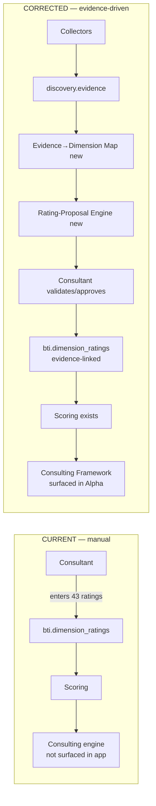
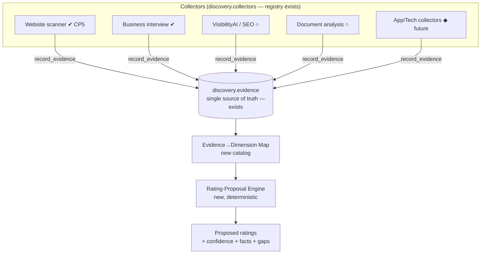
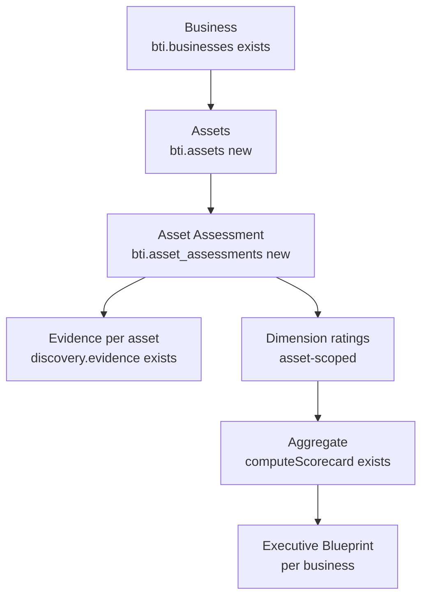
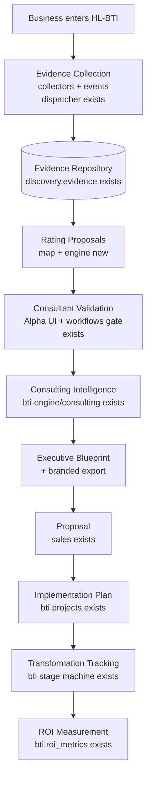
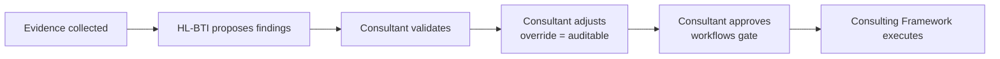

# Deliverable 6 — Architecture Diagrams

Rendered with Mermaid. Existing components are marked **(exists)**; the three new bridges and the asset layer are marked **(new)**.

## 1. Current vs. corrected



## 2. Evidence layer (reuses discovery.*)



## 3. Asset-based assessment



## 4. End-to-end engagement (Step 7)



## 5. Consultant workflow (Step 4)



## 6. Runtime integration

```mermaid
flowchart TD
  UI[HL-BTI Alpha\n wired to live backend] -->|bti.* RPCs| DB[(bti + discovery\n Supabase — apply 0026 first)]
  UI -->|invoke| EF[Edge function\n runs generateConsultingReport]
  EF --> ENG[@hl-bos/bti-engine\n scoring + consulting + rating-proposal]
  DB --> EF
  AIemitsAI[ai gateway + injection fence] --> EF
```
