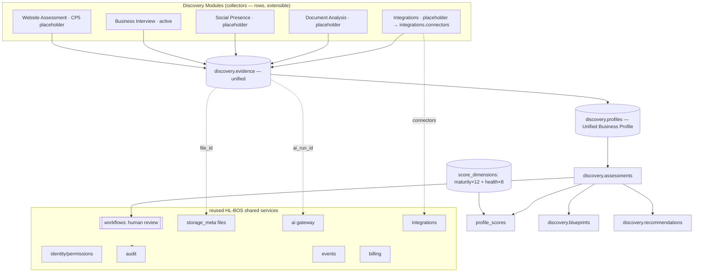
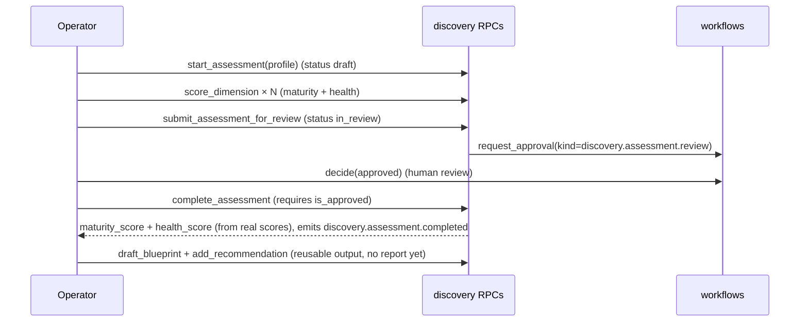

# Phase 1 · Deliverables 1, 2, 5, 6 (CP4) — Business Discovery Architecture

**Date:** 2026-07-27 · **Checkpoint:** 4 · **Migration:** `hlbos_0020_discovery` (local only)

The Business Discovery Engine is a shared HL-BOS capability: many evidence **collectors** feed **one** Unified Business Profile, which is scored by two data-driven frameworks and carried through an assessment workflow toward a transformation blueprint. The Website Scanner is now just Discovery Module 1 (an evidence collector), not the product.

---

## 1. Business Discovery Architecture Report

### 1.1 Layers

- **Collectors** (`discovery.collectors`, a row-catalog): Module 1 Website Assessment (placeholder, inactive), Module 2 Business Interview (active), Module 3 Social Presence (placeholder), Module 4 Document Analysis (placeholder), Module 5 Integrations (placeholder, reuses `integrations.connectors`). New collectors are **rows**, not migrations.
- **Evidence** (`discovery.evidence`): the single store every collector writes to.
- **Profile** (`discovery.profiles`): the canonical business representation, fed by all evidence.
- **Scoring** (`discovery.score_dimensions` + `discovery.profile_scores`): Digital Maturity (12 dims) + Business Health (8 dims), weights as rows.
- **Assessment** (`discovery.assessments`): lifecycle via the shared `workflows` engine; composite scores derived only from real scored dimensions.
- **Output containers** (`discovery.blueprints`, `discovery.recommendations`): reusable structures for the future blueprint/roadmap/ROI/subscription recommendation. No report generated this checkpoint.

### 1.2 System diagram

### 1.3 Extension points (interfaces only; no logic)

- **Website Scanner (CP5):** activate the `website_assessment` collector, then it records findings via `discovery.record_evidence(profile, 'website_assessment', 'website', key, value, confidence, refs, collection, file_id)`. `start_collection` refuses inactive collectors today (verified), so nothing runs until CP5 activates it.
- **Social / Document / Integrations:** same `record_evidence` path with `source` = `social` / `document` / `financial|crm`; documents attach a `storage_meta` `file_id`; integrations reuse `integrations.connectors`.
- **AI analysis:** an AI-derived finding is evidence with `ai_run_id` set (the model call is metered by the `ai` gateway; discovery only records the result).

## 2. Business Profile Data Model

`discovery.profiles` (canonical): `id`, `tenant_id`, `business_name`, `industry`, `status` (draft/active/archived), `prospect_id` → `visibility.prospects` (optional link), `summary` (jsonb rolled-up snapshot), `created_by`, timestamps. **One profile per business; every collector feeds it; no per-collector profile model.** RLS: read by `discovery.profile.read`; writes only via definer RPCs (`create_profile`, `update_profile_summary`).

## 3. Evidence Collection Architecture

`discovery.evidence` retains, for every finding: **source** (website/interview/document/social/financial/crm/ai/manual), **collector_key**, **key/value** (jsonb), **confidence** (0–1), **refs** (supporting references), optional **file_id** (document/screenshot) and **ai_run_id** (AI-derived), **collected_by**, **collected_at**, and full **audit** (trigger). `discovery.collections` records each collector run (status/started/finished/stats). One ingestion RPC (`record_evidence`) serves every collector — the reusable seam. Interview answers use `record_interview_answer` (a thin wrapper that maps a question to its evidence key). Separation of deterministic vs AI vs human evidence is by `source` + `ai_run_id` + `collected_by`.

## 4. Workflow Architecture

Reuses the existing `workflows` engine — no new engine. The assessment lifecycle maps to workflow states:

Lifecycle stages the design supports (per brief): Assessment Started · Evidence Collection · Evidence Validation · AI Analysis · Human Review · Assessment Complete · Blueprint Generation · Proposal Generation · Customer Approval · Provisioning Request. This checkpoint implements through **Assessment Complete + blueprint/recommendation containers**; proposal/customer-approval/provisioning are interfaces reused from `comms`/`workflows`/`billing`/`platform.provision_tenant` and remain unimplemented.

## 5. Future Business Transformation journey (interfaces only)

```mermaid
graph LR
    A[Business Discovery] --> B[Evidence Collection] --> C[Business Profile] --> D[Business Assessment]
    D --> E[Transformation Blueprint] --> F[Recommended Services] --> G[Customer Approval]
    G --> H[HL-BOS Provisioning] --> I[Software Factory] --> J[Create Digital Business]
    style E stroke-dasharray: 4 4
    style F stroke-dasharray: 4 4
    style G stroke-dasharray: 4 4
    style H stroke-dasharray: 4 4
    style I stroke-dasharray: 4 4
    style J stroke-dasharray: 4 4
```

Solid = implemented this checkpoint (Discovery → Evidence → Profile → Assessment, plus blueprint/recommendation containers). Dashed = reusable interfaces only, wired to existing shared services (`comms` delivery, `workflows` approval, `billing` subscription, `platform.provision_tenant`) and deferred.
